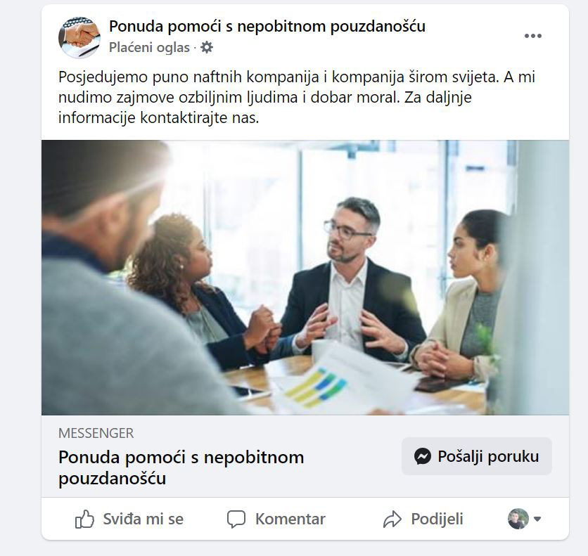
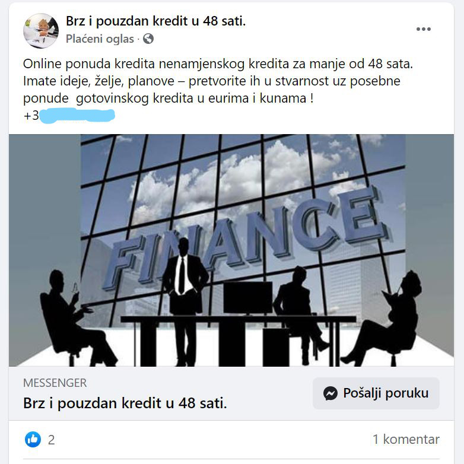
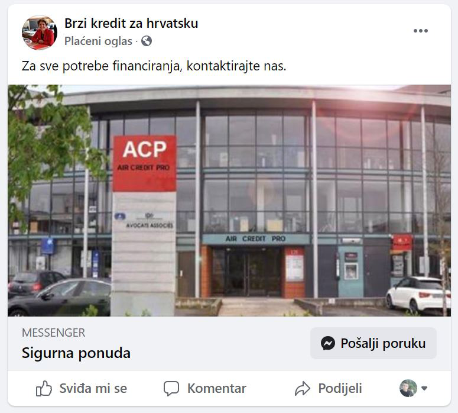

Zbog loše ekonomske situacije u državi, mnogo ljudi je prisiljeno financijsku pomoć potražiti kod neprovjerenih i nelegalnih osoba koja obećavaju niske kamatne stope i visoki iznos dostupnog kapitala. Pazite se tih osoba!

## Facebook stranice za kredite

Od početka problema s virusom Covid-19 počeo sam primjećivati **povećani broj Facebook stranica povezanih s financijama**. U početku sam mislio da su to blogovi koji pišu o temama povezanim s kreditima, kako pomoći ljudima ili možda od financijskih savjetnika koji tako žele doći do klijenata. Nisam se previše raspitao o tome budući da sam i sam počeo raditi na svojoj financijskoj stranici. Imao sam dosta poslao oko toga.

Kako je vrijeme prolazilo, sve više mi je takvih stranica iskakalo na naslovnicu Facebooka. Intenzitet se pojačao nakon nekog vremena od prisilnog zatvaranje koje je počelo u ožujku 2020. godine. Došlo je ljeto i još mi se manje dalo time zabavljati.

Eto kraj jeseni, a te stranice rastu kao gljive. Odlučio sam proći kroz nekoliko njih, istražiti malo po njihovim objava da vidim o čemu se zapravo radi. Listajući po njihovim profilima nisam imao puno za vidjeti. Nove stranice, jedva 30 lajkove i par generičkih fotografija nasmiješenih ljudi te nekoliko s novcem. Jedino što im piše u objava je da nude “povoljne kredite...2,5% kamata...nazovite na whatsapp broj: xxx”. Ovakvih objava s različitim varijantama ima na brdo. Neki nude kamate od 2,5%, neki 3% itd., s nekoliko desetka ili čak stotina tisuća eura mogućeg dostupnog kapitala. Sve u svemu, jako niske kamatne stope i jako velika količina dostupnog kapitala.

>Ali ima jedna stvar koju trebate znati: __*nijedna kredibilna institucija vam neće nuditi krenite preko WhatsApp broja!*__

Ovo su **lihvari**, tj. **kamatari**. 

Primjer 1. Facebook stranice koje nude zajmove

Primjer 2.

Primjer 3.

Ima još brdo ovakvih stranica. Samo napišite u pretraživač na Facebooku pojmove “kredit”, “zajmovi”, “pozajmice” ili nešto slično. Uvjerite se sami.

Možda se pitate zašto ih ima ovoliko puno i tko uopće uzima njihove zajmove. Odgovorit ću u daljnjem tekstu.

## Ekonomske poteškoće i rast lihvarskog posla

Lihvarenje (kamatarenje) raste u onim područjima koja **nemaju razvijenu financijsku infrastrukturu** te u onim područjima gdje **“normalni” putevi poput banaka ne žele financirati građane**. 

U Hrvatskoj se trenutno događa drugi razlog. Zbog prisilnog zatvaranja i postupaka države oko Covid-19 virusa, mnogo je poduzeća moralo obustaviti svoje poslovanje. Ljudi su izgubili svoja redovna primanja. Dugovi su, naravno, ostali.

Kada veliki broj klijenata upadne u probleme, teško da banke mogu “olakšavati” svima zato što će se onda i one same naći u problemima. Ima prostora za pomoći, ali o tome neću sada pisati. Sad se fokusiram na posljedicu ekonomskih i financijskih poteškoća.

Kako je mnogo ljudi imalo kredite, a neki su već i prije bili u blokadi, zbog prestanka rada ljudi su se našli u ozbiljnim problemima. Banke im ne daju zajmove te traže alternativne izvore financiranja. Ljudi su očajni, a nažalost, lihvarima je ovo san.

## Na što trebate obratiti pažnju

1. Kada čitate te Facebook stranice, vidjet ćete da na njima **nema nikakvih podataka o poduzeću ili osobi koja daje kredit**. Ne žele da se zna tko su. Ovo je **veliki alarm**.

2. Također, mora vam biti **sumnjiva niska kamatna stopa**. U bankama se kamatna stopa za gotovinske kredite kreće oko 6%. Pitajte se kako će neka osoba ponuditi stopu konkurentniju od te ili još bolje: **pitajte se ZAŠTO bi ponudili tu ili nižu stopu**.

3. Prođite kroz njihovu stranicu. **Vidite kakve su im objave**. Ako im se profil sastoji od generičkih fotografija ljudi u odjelima, nemaju nikakve informacije o sebi, nemaju web stranicu, imaju maleni broj lajkova i imaju samo par objava, onda vas molim da ih zaobiđete u širokom luku. 

## Skupo ćete platiti lihvarske niske kamate

Lihvarenje radi na principu “obećaj početno niske kamate, a onda ne daj da se izvuku s plaćanjem”. Na početku ćete platiti 2,5% koliko vam obećavaju Facebook stranice, ali ti postoci će brzo narasti. Možda ne ćete biti u prilici odmah platiti jednu ratu, a onda će vas dočekati hladan tuš gdje će lihvari zahtijevati da sljedeću ratu platite i po par puta više. Upast ćete u ralje i teško ćete se izvući. Trošak će vam samo rasti u astronomskim ciframa, a vi ne ćete moći vraćati tu količinu na vrijeme i onda će vam još više narasti. 

Budući da njihovo poslovanje nije legalno, lihvari mogu osigurati rad svojeg poslovanja i kapitala na dva načina:
1. **tražiti visoke kamatne stope s kojim će si osigurati vraćanje posuđenog kapitala**; i
2. **zastrašivanjem zajmoprimca**.

Oni moraju zastrašivati jer ako ostali zajmoprimci vide da se netko bez problema izvukao od duga, onda će i oni krenuti otkazivati “dogovor” te će se lihvar naći u velikim problemima i bez novca u džepu.

## Zaključno

Trenutno se nalazimo u lošoj ekonomskoj situaciji, a veliki broj je u financijskim neprilikama. Traže se razni načini kako preživjeti i financirati dugove ili neke druge potrebe.

Budite oprezni prema lihvarima. Vjerujte mi da ćete platiti puno veću cijenu nego što se početno čini. Savjetujte se s profesionalnim financijskim stručnjacima koji će vam pomoći u izradi plana kako se izvući iz problema. 

___
Ako želite i dalje čitati o financijama, investiranju i ekonomiji zapratite <a href="https://www.facebook.com/Pri%C4%8Dajmo-o-novcu-103037651540688" target="_blank" rel="noopener noreferrer">Facebook</a> i <a href="https://www.linkedin.com/in/dorian-ante%C5%A1i%C4%87-5255361a0/" target="_blank" rel="noopener noreferrer">LinkedIn</a> stranice bloga. 
-