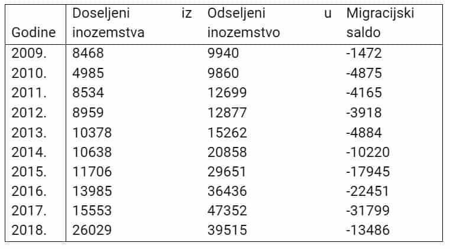

\*Izvorno napisano za blog <a href="https://www.liberal.hr/mirovinski-sustav-mirovine-944" target="_blank" rel="noopener noreferrer">Liberal.hr</a>. Slijedi nadopunjena verzija.

---

Kako bi se znali pripremiti za budućnost potrebno je da razumijemo sadašnjost. Ono što radimo sada odredit će kako će nam budućnost izgledati. Sa financijama to je još više naglašeno. Građani Republike Hrvatske moraju znati kako funkcionira mirovinski sustav, u kakvom je stanju i koji su trendovi koji će utjecati na njega. **Potrebno se financijski pripremiti za ono što slijedi kako ne bismo bili na rubu ili u siromaštvu**.

U suvremenim društvima kojima pripada Hrvatska mirovinski sustav je izrazito važan aspekt socijalne sigurnosti. Mirovinsko osiguranje koristi se kako bi se osigurali <a href="https://hrcak.srce.hr/30235" target="_blank" rel="noopener noreferrer">od rizika starosti, invalidnosti, smrti osoba u obitelji koje ju hrane te od rizika tjelesnog oštećenja</a>. Pogled na mirovinski sustav ima dvije perspektive, individualnu i kolektivnu, koje s vremenom prelaze jedna u drugu. **Individualna perspektiva** se mijenja kako starimo. S godinama nam postaje sve važnija adekvatnost mirovinskog sustava i kakva će nas mirovina dočekati. **Kolektivna perspektiva** uzima u obzir širu sliku te na mirovinski sustav utječe demografija, ekonomija, socijalna i politička determinanta društva .

U svijetu postoje razne vrste mirovinskih sustava koje se razlikuju po vrsti doprinosa, financiranju, raspodjeli rizika i odgovornosti itd., ali je svim sustavima zajedničko odgovaranje na isto pitanje:

> **_koliko puno su ekonomski aktivne osobe spremne izdvojiti za plaćanje svojih potreba i potreba drugih trenutno i u budućnosti_**.

Do 2002. godine hrvatski mirovinski sustav sastojao se od plaćanja doprinosa kroz sustav međugeneracijske solidarnosti. Takav sustav je bio uspješan u povijesti jer je stanovništvo bilo mlado, ponajviše u 80-ima 20.stoljeća kad je omjer radnika naprema umirovljenima bio 4:1. Tijekom godina taj je omjer padao i sada **na jednog umirovljenika dolazi 1,23 radnika**. U 2002. godini napravljena je mirovinska reforma gdje su uvedena tri stupa koja su trebala riješiti problem starenja stanovništva i neodrživosti sustava međugeneracijske solidarnosti.

**Prvi stup** temelji se na starom modelu međugeneracijske solidarnosti. Doprinosi od bruto plaće iznose 15 % i njima se financiraju mirovine sadašnjih umirovljenika, tako zvani „pay-as-you-go sistem“.

**Drugi (obvezni) stup** se zasniva na individualiziranoj kapitaliziranoj štednji. Iznosi 5 % od bruto plaće za doprinose mirovinskom osiguranju. Spoj je privatnog i javnog sektora jer fondovima koji čine stup upravljaju privatna poduzeća, ali prema pravilima Hrvatske agencije za nadzor financijskih usluga koja ih nadzire. Svaki osiguranik ima vlastiti račun u <a href="https://regos.hr/osiguranici/stanje-na-osobnom-racunu" target="_blank" rel="noopener noreferrer">Središnjem registru osiguranika (Regos)</a> te se vrijednost osobnog računa dobije tako da se množi ukupni broj obračunskih jedinica na računu s vrijednošću obračunskih jedinica mirovinskog fonda u kojem osiguranik ima otvoren račun.

**Treći (dobrovoljni) stup** isto je kao i drugi stup zasnovan na individualnoj kapitaliziranoj štednji, ali je on, za razliku od drugoj, dobrovoljni te u njega ulažu osobe koje se žele dodatno zaštiti od starosti, invalidnosti ili smrti.

## Problem istraživanja

Problem istraživanja u ovom članku je održivost hrvatskog mirovinskog sustava s obzirom na njegove karakteristike, trendove koji se događaju u modernom dobu, problemima s kojim se suočava te odgovorima na njih. Usporedit će se s drugim svjetskim modelima mirovinskih sustava te utvrditi je li sustav održiv ili nije.

Pogoršanje situacije dovelo je do toga da doprinosi više ne mogu pokriti <a href="http://www.mirovinsko.hr/UserDocsImages/Upravnovijece/sjednice/30_05062019/3_Izvjesc_o_financijskom_poslovanju_Zavoda_za_2018.pdf" target="_blank" rel="noopener noreferrer">mirovinske rashode</a> tako da **prihodi od doprinosa iznose 55,56 % ukupnih prihoda**, a **prihodi iz državnog proračuna i ostalog čine 44,44 %**. Dva su temeljna razloga povećanja mirovinskih rashoda: <a href="https://www.bib.irb.hr/341553" target="_blank" rel="noopener noreferrer">demografsko-organizacijski i financijsko-sustavni</a>.

**Demografsko-organizacijski** razlozi vezani su za starenje stanovništva, što treba razdvojiti od biološkog starenja. Glavni razlog je kontinuirani trend povećanja udjela starijeg stanovništva (od 65 godina) uz istovremeno smanjivanje novorođenih. Taj trend slijedi i smanjivanje odnosa broja osiguranika i broja umirovljenika. Kao završni razlog, uz prevelik broj povlaštenih mirovina, mora se spomenuti i preširoka primjena definicije invalidnosti zbog čega je mnogo osoba ostvarilo invalidsku mirovinu.

U vremenu visoke nezaposlenosti 1990-ih kao rješenje smanjivanju tog problema i ublažavanju socijalne napetosti koristilo se mirovinsko osiguranje te je do dovelo do prevelikog tereta za gospodarstvo.

**Financijsko-sustavni** razlozi vezani su za prirodu i obilježja sustava međugeneracijske solidarnosti. Postoji problem ne povezanosti mirovinskih doprinosa i isplata jer se sve današnje uplate koriste za uzdržavanje sadašnjih umirovljenika. Ti isti umirovljenici su za vrijeme svojega radnog vijeka uplaćivali po nižim stopama, ali primaju mirovine po mnogo većim stopama doprinosa koje onda terete zaposlene. Kao dodatni problem javlja se i pitanje pravednosti te nemogućnosti davanja jamstva da će mirovinski sustav koji je na raspolaganju jednoj generaciji biti dostupan sljedećoj, naročito ako uzmemo u obzir nepovoljni trend pada omjera broja osiguranika i broja umirovljenika.

## Usporedba sa svijetom

Svjetska je banka osmislila koncept za mirovinske fondove kako bi pomogla državama da imaju određene kriterije po kojima će kreirati vlastite sustave. Kriteriji koje bi svaki mirovinski sustav trebao ispuniti kako bi bio održiv jesu: adekvatnost, dostupnost, održivost, predvidljivost i robusnost.

**_Adekvatan_** je onaj sustav koji svojim pogodnostima omogućava sprječavanje siromaštva u starijoj dobi na razini ukupnog stanovništva uz pružanje pouzdanog izvora za lagodnu životnu potrošnju većini stanovništva.

**_Dostupan_** je onaj sustav koji je u okviru mogućnosti financiranja od strane pojedinaca i društva i koji ne odbacuje pretjerano ostale društvene i ekonomske imperative niti ima neizdržive fiskalne posljedice.

**_Održiv_** je onaj sustav koji je financijski pouzdan i može se održavati u doglednom horizontu pod širokim setom raznih pretpostavki.

**_Predvidljiv_** je onaj sustav čije su beneficije (i) određene zakonom i ne podliježu diskreciji kreatora politike i administratora; (ii) uključuju odredbe o indeksaciji kako bi se pojedinca izoliralo od inflacije, prilagodbe plaća i kamata prije i nakon umirovljenja i (iii) što više izolirati umirovljenika od rizika dugog života.

**_Robustan_** je onaj sustav koji ima kapaciteta da izdrži velike šokove, uključujući one koji proizlaze iz ekonomske, demografske i političke nestabilnosti.

Slično tom konceptu <a href="https://www.mercer.com.au/our-thinking/mmgpi.html?utm_medium=referral&utm_source=vanity&utm_campaign=mmgpi" target="_blank" rel="noopener noreferrer">svjetsko konzultantsko poduzeće Mercer</a> je osmislilo indeks po kojemu će rangirati kvalitetu mirovinskih sustava u svijetu (za određene države). Oni su kao kriterije za svoj indeks stavili adekvatnost, održivost i integritet sustava. Tri najbolja sustava prema tom indexu su nizozemski, danski i australski.

Nizozemski sustav ima adekvatnost 78,5 bodova od 100 mogućih, održivost 78,3 i integritet 88,9. Danski ima adekvatnost 77,5, održivost 82 i integritet 82,2. Australski kao treći najbolji mirovinski sustav ima adekvatnost 70,3, održivost 73,5 i integritet 85,7.

Sva tri mirovinska sustava pokazuju visoku stupanj razvijenosti i prilagodljivosti modernom dobu. Sustavi su im financijski prihvatljivi, zadovoljavaju osnovni zadatak mirovinskih sustava, tj. osiguravaju stanovništvo od rizika starosti, invaliditeta i smrti hranitelja obitelji.

Hrvatski mirovinski sustav nije uzet u računanje indexa, ali će se stoga u narednoj cjelini prikazati argumenti je li blizak trima najboljima i je li održiv.

## Adekvatnost hrvatskog mirovinskog sustava

Mirovinsko osiguranje u Hrvatskoj **nije dovoljno kako bi osiguralo stanovništvo u starijoj dobi od rizika siromaštva**. Osiguranje od tog rizik je jedno od temeljnih zadataka mirovinskih sustava te je ključan za kvalitetno funkcioniranje stanovništva do svoje smrti.

Tablica 1. Udjel umirovljenika kojima prijeti siromaštvo (%)

Izvor: Izrada autora prema podacima s Eurostata

Kao što se može vidjeti u Tablici 1. udjel umirovljenika kojima prijeti siromašno u Hrvatskoj povećava se od 2012. godine s povremenim smanjenjem i u 2018. godini iznosi 25,7 %. Hrvatska od prosjeka Europske unije odskače za velikih 10,4 % što predstavlja problem i Europskoj uniji zbog politike konvergencije i kohezije. Svakom četvrtom umirovljeniku prijeti opasnost od siromaštva, a kroz trenutni sustav mirovinskog osiguranja trend će se samo pogoršavati.

## Dostupnost mirovinskog sustava

Doprinos za prvi stup iznosi 15 % bruto plaće, a doprinos za drugi 5 % bruto plaće. Budući da hrvatske plaće nisu velike tih 20 % bruto plaće čine veliki teret pojedincu i smanjuju mu kupovnu moć. Također, visoki mirovinski izdaci i visoke stope doprinosa povećavaju cijenu rada što smanjuje produktivnost, potiče nezaposlenost, zapošljavanje u neslužbenom gospodarstvu i neplaćanju samih doprinosa što u konačnici povratno povećava jaz između prihoda i izdataka mirovinskog osiguranja.

Zemlja u nižem stupnju razvoja (u usporedbi s ostalim zemljama članicama Europske unije) ne može podnesti veliki teret umirovljene radne snage zato jer ono sputava produktivnost aktivnog radnog stanovništva i čini ga nekonkurentnim.

Već sada doprinosi od pojedinaca ne predstavljaju dovoljan iznos kako bi se pokrili troškovi mirovinskog osiguranja pa država iz proračuna nadoknađuje razliku. Nažalost taj jaz između prihoda iz doprinosa i rashoda sustava nije maleni. U 2018. godini situacija je došla do te razine da država mora iz proračuna pokriti čak 44,44 % rashoda mirovinskog osiguranja.

Grafikon 1. Rashod HZMO-a za mirovine i mirovinska primanja

Izvor: Izrada autora prema podacima HZMO-a

Na Grafikonu 1. vidljivo je da rashodi u svakom mjesecu u od 2017. do 2019. godini imaju rastući trend te se njihovo smanjivanje ne predviđa u budućnosti s obzirom na godišnje povećanje broja korisnika mirovinskog osiguranja.

## Održivost hrvatskog mirovinskog sustava

Struktura je stanovništva pogođena demografskim promjenama u fertilitetu, mortalitetu i migraciji te je to dovelo hrvatski mirovinski sustav u duboku krizu jer se iz postojećih doprinosa nisu mogli financirati umirovljenici. Manjkovi su financirani od transfera iz državnog proračuna i zaduživanjem na domaćem i inozemnom financijskom tržištu. Demografske promjene u potpunosti su napravile mirovinski sustav ne održivim, a ponajviše prvi stup koji je temeljni izvor prihoda. Problem hrvatskog mirovinskog sustava leži u njegovoj strukturi.

**_Prvi stup_**, koji se temelji na sustavu međugeneracijske solidarnosti, nema budućnosti jer se omjer radnika i umirovljenika toliko smanjio da skoro jedan radnika treba osigurati mirovinu jednom umirovljeniku. Takav model je bio moguć za vrijeme demografske ekspanzije u prošlosti, ali moderno hrvatsko doba obilježava niska stopa fertiliteta, povećanje životnog standarda i migracija radne snage u inozemstvo.

Grafikon 2. Odnos broja osiguranika i broja korisnika mirovina (1980. - 2018.)

Izvor: Izrada autora prema podacima HZMO-a

Kao što je vidljivo na Grafikonu 2. odnos broja osiguranika i broja korisnika izrazito je strmog i negativnog prirasta bio do mirovinske reforme započete 1998. i implementirane 2002. godine. Reformom se odnos primirio i nije više bio toliko nagao, ali ponajviše zato jer su svi koji su mogli u mirovinu u nju i otišli. Odnos je od 2002. do 2018. i dalje padao te u 2018. iznosi **1:1,22**, tj. na 1,22 radnika dolazi jedan umirovljenik. Da se taj omjer neće poboljšavati u budućnosti dokazuje i prirodno kretanje stanovništva Hrvatske koje se može vidjeti u Tablici 2.

**_Drugi stup_** je osmišljen kao prijelaz iz sustava međugeneracijske solidarnosti u sustav temeljen na individualiziranoj investicijskoj štednji. Sastoji se od tri kategorije fondova: A - visoko rizični, B - srednje rizični i C - nisko rizični. Ovi bi fondovi trebali prikupljati novčana sredstva i s njima kupovati financijske instrumente kako bi ostvarili pozitivni prirast i povećali imovinu sadašnjim i budućim umirovljenicima. Međutim postoji intrinzični problem u strukturi ovog stupa koji svoj primarni cilj (povećanje imovine) stavlja po strani kako bi zadovoljio političke ciljeve vlasti.

Prvi problem je u strukturi ulaganja mirovinskih fondova, tj. u imovini koji oni drže pod sobom. **Mirovinski fondovi zapravo služe kao posrednici između države i građana** gdje država posuđuje novce od građana tako što mirovinski fondovi kupuju njezine obveznice uz određeni prinos kako bi država financirala svoje tekuće potrebe.

Grafikon 3. Struktura imovine obveznih mirovinskih fondova prema vrsti ulaganja (Kategorije A, B i C)

Izvor: Izrada autora prema podacima HANFA-e

Prema Grafikonu 3. vidljivo je da je većina ulaganja mirovinskih fondova u obveznicama, čak i u visoko rizičnoj kategoriji „A“ u 2019. godini obveznice čine skoro 40% imovine. Fondovi zapravo služe državi kako bi se financirala što nas dovodi do drugog problema - prevelika izloženost domaćem tržištu.

Drugi problem mirovinskih fondova je nepregledan rizik kojega građani preuzimaju u drugom stupu. Svrha diverzifikacije i aktivnog upravljanja mirovinskim fondovima je umanjenje rizika od volatilnosti tržišta uz održavanje iste stope prinosa. Osim što fondovi imaju lošu diverzifikaciju u imovinskoj strukturi ulaganja oni također imaju lošu geografsku strukturu ulaganja.

Grafikon 4. Struktura imovine obveznih mirovinskih fondova prema domicilnosti (Kategorija A, B i C)

Izvor: Izrada autora prema podacima HANFA-e

Prema podacima iz Grafikona 4. velika većina imovine obveznih mirovinskih fondova se nalazi u financijskim instrumentima domaćeg tržišta što predstavlja problem prevelike izloženosti jednom tržištu. Politika ulaganja ide prema financiranju države umjesto prema glavnom cilju povećanja imovine sadašnjih i budućih umirovljenika.

Kako prvi i drugi stup svaki na svoj način financiraju državu ovo pokazuje splet odnosa koji ne ide u korist građanima jer sustav zapravo ne služi svojoj primarnoj svrsi nego radi više kao instrument zadovoljavanja potreba vlasti.

**_Treći stup_** koji radi na principu dobrovoljne individualizirane kapitalizirane štednje također ima svoje probleme. Ušteđena/uložena novčana sredstva osiguranici mogu preuzeti tek u kasnijoj životnoj dobi. Prije je bio prag 50 godina, ali sada je povišen na 55. Pored toga, državni poticaji za uplaćivanje u ovaj stup se kontinuirano smanjuju te sada iznose najviše 750 kn ako se u godini dana uplati do 5.000 kn. Pomicanje granice i smanjivanje državnih poticaja predstavljaju nepredvidljivost hrvatskog mirovinskog sustava.

## Predvidljivost mirovinskog sustava

U svakoj demokraciji postoji sudar između logike dugoročnih obveza i logike promjene politike. S jedne strane vremenska dimenzija zahtjeva održivost i kontinuitet dok je s druge strane politička dimenzija često kontradiktorna zbog toga što je podložna raznim jakim društvenim pritiscima i političkim koalicijama: ponajviše umirovljenicima i onima blizu umirovljeničke dobi koji spadaju u <a href="https://hrcak.srce.hr/index.php?show=clanak&id_clanak_jezik=220614" target="_blank" rel="noopener noreferrer">najveću grupu glasača</a>.

Problem neodrživosti hrvatskog mirovinskog sustava očitava se i u njegovoj stalnoj izmjeni i padu povjerenja u njega. Dok se sustav bori sa kontroliranjem rashoda i pribavljanjem prihoda građani gube povjerenje u njega i u vladu zbog česte izmjene prvog stupa. **Od 1998. do 2020. godine prvi stup mirovinskog sustava doživio je preko 20 izmjena**.

## Robusnost mirovinskog sustava

Hrvatski mirovinski sustav nema karakteristike robusnosti (otpornosti) i to se može objasniti kroz Grafikon 2. Omjer odnosa broja osiguranika i broja umirovljenika u padu je desetljećima i ne namjerava stati. Stanovništvo stari, negativni je prirodni prirast i velika je migracija prema inozemstvu.

Tablica 2. Vanjska migracija stanovništva Republike Hrvatske

Izvor: Izrada autora prema podacima Državnog zavoda za statistiku

Prema Tablici 2. od 2009. godine nije se dogodilo da jedna godina ima pozitivni migracijski saldo. S obzirom na otvorenost prema Europskoj uniji može se pretpostaviti da će ovakvo stanje potrajati još makar nekoliko godina.

## Problemi u strukturi sustava

Osim demografski poteškoća probleme možemo naći u samoj strukturi hrvatskog mirovinskog sustava. Isprepletenost triju stupova i odnos stanovništva, mirovinskih fondova i države predstavlja konačni argument za neodrživost i neotpornost hrvatskog mirovinskog sustava.

Prvi stup direktno financira dio tekućih rashoda mirovinskog sustava, a ostatak država nadopunjuje. U drugom i trećem stupu mirovinski fondovi prikupljaju novce od stanovništva i kroz kupnju državnih obveznica financiraju ostale rashode države.

Reformom iz 2002. bilo je zamišljeno da će mirovinski fondovi ulaganjem u gospodarstvo (poduzeća) dati stimulans razvoju te će se time značajnije povećati plaće i onda mirovine. Ovo se nije dogodilo.

Zbog velikog udjela državnih obveznica u mirovinskim fondovima dolazimo do **paradoksa sustava**. Mirovinski fondovi biti će jedino uspješni kada je hrvatska ekonomija u lošem položaju, tj. kada ima niski kreditni rejting. Kada država ima niski kreditni rejting ona se mora zaduživati po većim kamatnim stopama jer je investitorima rizičnija pa na taj način privlači njihove investicije. Kada hrvatsko gospodarstvo ojača ono dobiva veći rejting i sukladno s time ima veću mogućnost jeftinijeg zaduživanja. Samo jačanje hrvatskog gospodarstva znači da će prinos hrvatskih mirovinskih fondova biti niži.

Reformom se učinilo to da je država umjesto punih 20% za mirovine dobila 15%, a preostalih 5% je posudila od fondova s kamatnom stopom. **Država je zadužila samu sebe**.

## Zaključak

Sve navedeno čini sustav krhkim daljnjim šokovima koji se mogu vrlo vjerojatno dogoditi, a i upravo se događaju kada uzmemo u obzir financijsku i ekonomsku krizu.

Sustav je previše ovisan o događajima unutar države i nema dovoljno neovisnost kako bi ispunjavao svoj prvotni cilj o osiguranju stanovništva o rizicima starosti, invalidnosti, smrti osoba koje hrane obitelj te od teškog tjelesnog oštećenja.

Rješenja za ove probleme treba tražiti u **individualnoj kapitaliziranoj štednji**, kao što je treći mirovinski stup, ali na vlastitu odgovornost i slobodu izbora. Potrebno je napraviti tranzicijsko razdoblje gdje će **novi radnici direktno ulaziti u novi mirovinski sustav temeljen na vlastitoj štednji, postojeći radnici će polako prelaziti u novi, a umirovljenicima će se nastaviti isplaćivati mirovina.**

Ljudi neće trebati samostalno ulagati, postoje financijski stručnjaci za to, ali će imati slobodu izbora da odluče gdje, kada i koliko će ulagati. Mirovinski fondovi će također nastaviti postojati ali radnici će moći izabrati žele li nastaviti uplaćivati u njihove fondove ili žele novce na svoj račun pa će kasnije odlučiti gdje žele uložiti.

Sustav temeljen na vlastitoj štednji ne samo da će biti **pravedniji** (ovisi isključivo o izboru osobe) nego će **povećati financijsku pismenost stanovništva** i time ih učiniti **više aktivnijim u odabiru boljih rješenja za vlastito buduće financijsko stanje**.

Ono što je bitno za građane je da shvate hrvatski mirovinski sustav i proporciju njegovog problema te da ne računaju na mirovinu kao glavni izvor svojega prihoda. Ključno je da se građani aktiviraju u dvije stvari:

1. Trebaju **tražiti od političara izmjenu mirovinskog sustava** prema modelu **individualne kapitalizirane štednje** tako da **građani samostalno štede i investiraju** za vlastito umirovljenje

2. Trebaju **osigurati dodatna financijska sredstva za umirovljenje** koji će im služiti kao **glavni izvor prihoda**.

Građani trebaju povećati svoju financijsku pismenost te naučiti štediti i investirati ušteđeno. To će najbolje postići pametnim budžetiranjem i upravljanjem primarnog izvora prihoda - plaćom. Uspješno budžetiranje i upravljanje osobnim financijama predstavlja temelj zdravog financijskog stanja osobe te osigurava sretniju i lagodniju budućnost i umirovljenje.

Ako želite i dalje čitati o financijama, investiranju i ekonomiji zapratite <a href="https://www.facebook.com/Pri%C4%8Dajmo-o-novcu-103037651540688" target="_blank" rel="noopener noreferrer">Facebook</a> i <a href="https://www.linkedin.com/in/dorian-ante%C5%A1i%C4%87-5255361a0/" target="_blank" rel="noopener noreferrer">LinkedIn</a> stranice bloga. 
-