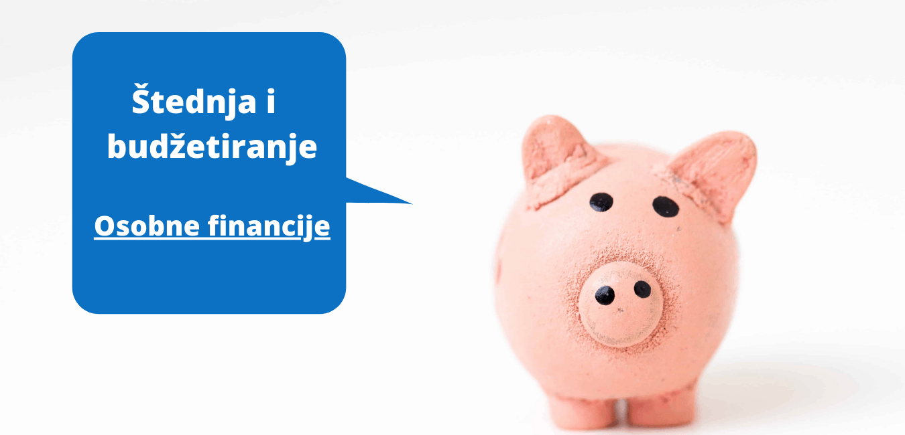

Budžetiranje vlastitih prihoda i rashoda te štednja vrlo su važan aspekt unutar osobnih financija. Predstavljaju temelj na kojem ćemo graditi naše financijsko stanje. Dobro napravljen budžet kojeg se držimo i marljiva štednja povećat će naše blagostanje i učiti našu financijsku sliku zdravom.

## Osobni budžet

Prije nego što krenemo učiti kako ulagati novac trebamo “pronaći” taj novac za ulaganje. Ljudi pričaju o ulaganjima, mediji pokazuju uspješne investitore, priča se o rastu dionica itd., ali većina ljudi koji nisu u tim “investitorskim” vodama postavlja jedno jedino pitanje - **“a od kuda meni novac za ulaganje?”**

Dobro pitanje. Postavio sam ga i ja puno puta dok nisam počeo učiti o financijama. Prije svakog ulaganja treba imati i viška novca za ulaganje. Većina ljudi ga nema ili bolje rečeno, smatra da ga nema. Privržen sam mišljenju da većina ljudi IMA viška novca za ulaganje, ALI ga mora pronaći u svojem OSOBNOM budžetu.

Osobni budžet (proračun) predstavlja izračun svih prihoda i rashoda u određenom vremenskom razdoblju, najčešće godini dana ili u mjesecu.

Kada kažem da većina ljudi ima viška novca za štednju, a onda ulaganje ne mislim pritom na tisuće i tisuće kuna pa ni stotine. Mislim čak i na 10 kuna mjesečno. Štednja počinje s bilo kojim iznosom kojeg postepeno povećavate. Važno je krenuti!

Što se prije krene sa štednjom to će vam biti lakše i steći ćete naviku za njenim povećanjem. Kada pogledate na štedni račun ili neko mjesto gdje štedite bit će vam sve draže i draže kako se brojka povećava.

Od 10 kuna mjesečno brzo ćete doći do 100, a onda i do 1.000 kuna mjesečno. Iznos će ovisiti o vašem cilju štednje, ali prije nego što odlučite zašto želite štedjeti potrebno je da organizirate svoje financije.

Organizacija financija je područje koje se dugo proučava od strane financijskih stručnjaka. Do sada je postalo uvriježeno mišljenje da je model organizacije po postocima plaće 50/30/20 najbolji, a zasigurno bih rekao da je najdjelotvorniji za početnike.

## Što predstavlja 50/30/20?

**Model 50/30/20** predstavlja podjelu plaće u postocima prema **potrebama 50%**, **željama 30%** i **štednji 20%**.

_____________

**Preuzmite besplatno tablicu za budžetiranje
<a href="https://docs.google.com/spreadsheets/d/1rE2q1abWOibWLvsZ0kQhH9JSBQsuQzixTn4OqAg3fLQ/edit?usp=sharing" target="_blank" rel="noopener noreferrer">50/30/20 model za Budžetiranje - Google tablica</a>**

**Nakon što preuzmete <ins>napravite kopiju i u njoj upisujte podatke</ins>**

---

### Korak 1. Sastavite listu prihoda i rashoda

Za početak napišite sve svoje prihode i rashode koje imate kroz mjesec dana i kroz godinu. Prihodi se sastoje od svega što dolazi NA vaš račun: od plaće, dividenda, prihoda ako iznajmljujete apartmane, novac od prodaje neke imovine itd. Pod rashode svrstavamo sve ono što ide VAN vašeg računa: od hrane i pića, rate kredita za kuću, rate kredita za minus na kartici, mobilne tarife, odjeće i obuće, izlaska vani itd.

### Korak 2. Ograničite svoje _potrebe_ na 50% prihoda

Pod **potrebe** uvrštavamo sve ono **bez čega ne možemo i što ne možemo bez ekstra troška odgoditi**. U ovo spada hrana, piće, rata od kredita za kuću, odjeća i obuća, režije, gorivo, porezi.

Analizirajte koje imate potrebe, jesu li vam sve one zapravo bitne i u kojem omjeru te što možete napraviti da ih smanjite. Pokušajte da sve potrebe budu unutar 50% prihoda (što manje to bolje).

### Korak 3. Ograničite svoje _želje_ do 30%

Pod **želje** svrstavamo ekstra stvari koje nam čine život ljepšim. To su putovanja, izlasci vani, mobilne tarife za neograničeni internet, Netflix, skuplja odjeća i obuća, luksuzniji auto, dopunsko zdravstveno osiguranje, dodatno obrazovanje itd.

Često dolazi do miješanja _potreba_ i _želja_ kada se izračunava u proračunu. Proučimo primjer odjeće. Za vrijeme zime svima je potrebna topla odjeća. To je _potreba_, nužna, ne možemo se toliko smrzavati kako bi uštedjeli. Uzmimo da sasvim u redu topla majica košta 100 kn. Majica će nas grijati super i tehnički nam ne treba ništa više od toga. Možda ima neka jeftinija majica, ali ona je recimo od lošijeg materijala pa dugoročno nije isplativo (**uvijek preporučujem gledati dugoročno**). Pored te majice u trgovini se nalazi skuplja majica od 300 kn koja nam izgleda odlično i zaista bismo je htjeli imati. Ona je naša _želja_ jer nam toliko skuplja majica zapravo ne treba. Ako se odlučimo ipak kupiti tu skuplju majicu onda u proračunu bilježimo ovako:

|                | Potrebe |       Štednja        |
| :------------- | :-----: | :------------------: |
| Skuplja majica | 100 kn  | (300 - 100) = 200 kn |

Uzimamo 100 kn kao od _potreba_ jer bi nas toliko došla “obična” majica koja bi nam bila sasvim dovoljna, a 200 kn uzimamo od _želje_ jer nam nije nužna, ali je ipak želimo.

Ovako računamo za svaku stavku gdje nešto može biti potreba, a nešto želja.

Ovisno o vašim ciljevima postotak u _željama_ može biti i manji, primjerice 20%, a ostatak ide u štednju. Osobnom se najviše koncentriram da “zadovoljim” svoje dodatno obrazovanje. Na njemu ne štedim toliko jer znam da me to obogaćuje. Putovanja također, mada uvijek razborito jer se može uvijek putovati jeftinije ili kombinirati s nekim drugim događajima poput Nove godine, godišnjice ili sličnog.

### Korak 4. Odvojite 20% za _štednju i otplatu dugova_

Sada dolazimo do najslađeg dijela i onog kojeg veliki broj ljudi preskoči. Iako ovak korak dolazi na kraju, ja vam ga **toplo preporučam da ga napravite ODMAH nakon što izlistate sve prihode i rahode**. Ovaj princip se zove “pay-yourself-first” ili na hrvatskom “**prvo plati sebi**”.

Princip označava važnu životnu filozofiju. Dobrobit vaše budućnost je najvažnije stvar do koje bi vam trebalo biti stalo. “Prvo plati sebi” znači da si vi odmah od “viška” novca uplatite za vaše buduće financijske ciljeve. Tako vi postavljate prioritet i govorite sebi i svijetu da ste ozbiljni u vašoj namjeri da ostvarite postavljene financijske ciljeve.

Pod _štednju i otplatu dugova_ svrstavamo štednju za neko buduće razdoblje: mirovina, školovanje; zatim ekstra otplatu dugova minusa na karticama, osnivanje fonda za izvanredne okolnosti itd.

Preporuka je prvo **osnovati fond za izvanredne okolnosti** koji će vam služiti za pokrivanje izvanrednih troškova poput života nakon gubitka posla, popravka auta, hladnjaka, bolesti itd. Preporuča se da u fondu bude novca u iznosu od 3 do 6 mjeseci troškova. Znam da je to dosta novca, ali fond je uistinu potreban. Svakome se može dogoditi neki izvanredni slučaj i nastat će veliki problem ako ga ne možemo platiti na vrijeme. Što prije krenete s punjenjem fonda to će vam cilj biti sve dostižniji.

Osim osnivanja fonda za izvanredne okolnosti sljedeće po važnosti je **ekstra otplata dugovanja** poput dodatnog uplaćivanja za rješavanja minusa na karticama, vraćanje dugova obitelji, kredita na auto i slično. Ovdje je isti slučaj kao i kod dileme potrebe-želje.

> **Kamate** za minus na kartici su **ogromne** i iznose **preko 10%** što su veliki novci. **Njih treba što prije platiti!**

Ako osnovna rata za minus od 1.000 kn mjesečno iznosi 100 kn, onda svako plaćanje iznad toga spada u ovih 20% od _štednje i otplate dugova_. Znači ako mjesečno dobrovoljno uplatite 200 kn, onda 100 kn računate iz dijela za _potrebu_, a dodatnih 100 kn iz dijela za _štednju_.

**\*Napomena**: S obzirom na to da je ovaj model 50/30/20 skovan u Sjedinjenim Američkim Državama gdje nemaju prisilno uplaćivanje doprinosa za mirovinsko osiguranje trebamo raščistiti neke stvari. U Hrvatskoj imamo bruto i neto plaću. Ovdje smo do sada pričali o podjeli **NETO plaće** na 50/30/20 postotaka. Za kraj smo rekli da 20% ostavljamo sebi za budućnost kao primjerice mirovinu. Ako jednako primijenimo model iz SAD-a na Hrvatsku onda tehnički vi već i štedite ovih 20% budući da moramo uplatiti doprinos za mirovinsko osiguranje u iznosu od 20% naše bruto plaće. Nažalost u Hrvatskoj se ne može samostalno odlučivati gdje želimo uplatiti tih 20% bruto plaće za naše umirovljenje jer nas država na to pisiljava. Iako već tehnički uplaćujemo od bruto plaće moja je preporuka da i **OD NETO PLAĆE uplatimo sebi tih 20%**. Znači još 20% od neto plaće kao što smo odvajali i 50% za potrebe i 30% za želje. <a href="https://www.antesic.com/hrvatski-mirovinski-sustav-nije-odrziv-analiza-i-smjernice/" target="_blank" rel="noopener noreferrer">Hrvatski mirovinski sustav nije održiv</a> te će nastaviti generirati **jako niske mirovine ili će čak i propasti**. Već sada skoro polovicu rashoda mirovina mora pokriti država od drugih poreza.

> Nužno je da **prestanete razmišljati o mirovini kao glavnom izvoru prihoda nakon što se umirovite**. Razmišljajte o državnoj mirovini kao “**dodatnom prihodu**”, a tijekom života **štedite i investirajte** kako bi vam ta sredstva postala **glavni izvor novca nakon umirovljenja**.

### Korak 5. Pregledajte što ste sastavili

Uzmite si par sati za razmišljanje i sastavljanje budžeta. Odredite si ciljeve. Nakon što ste sve napravili prođite još jednom. Ako ne možete sami uraditi, **obratite se financijskom savjetniku**. Nemojte se bojati. Ne štedite na pomoći. Znam da većina ljudi ne koristi usluge financijskih savjetnika. Ljudi misle da je to za bogate, ali nije samo za njih. “**Dobar savjet zlata vrijedi**”. Ova izreka je od velike točnosti kada se priča o financijama.

Razmislite o ovome. U lošoj ste financijskoj situaciji. Mučite se s novcem, a imate određene ciljeve koje biste željeli ostvariti. Isplati li vam se više i dalje mučiti i nikako ili jedva kretati se prema cilju ili vam se više isplati dogovoriti sastanak s financijskim stručnjakom, platiti mu recimo 500 kn i dobiti pomoć koja će vam brže i bolje ostvariti ciljeve? Ako ne otiđete kod stručnjaka, hoćete li zapravo uštedjeti tih 500 kn? **Dobra stručna pomoć, kao i kod liječnika, dati će vam veću vrijednost nego onu koju ste platili**.

## Zaključak

Budžetiranje vlastitih prihoda i rashoda temeljna je zadaća svake osobe koja želi imati zdravu financijsku sliku. Kada vidimo “na papiru” sve naše prihode i rashode, kada ih analiziramo onda možemo jasno razumjeti što nam je raditi. Možemo razaznati što nam treba, a što ne; što ćemo izbaciti ili smanjiti, a na čemu moramo raditi da povećamo.

Štednja nam daje moć. Ona osigurava da hodamo dignute glave s ponosom. Kada znamo da imamo na računu dovoljno novca da možemo živjeti 6 mjeseci bez rada osjećamo se slobodnije i sigurnije na ovom svijetu. Zapravo to i jesmo. Možemo lakše birati radno mjesto, mjesto ili državu življenja. Možemo sve lakše. Ne trebamo biti u strahu za egzistenciju te trpiti zadane okolnosti. Okolnosti krećemo mijenjati. Postajemo aktivniji u mijenjanju i poboljšanju vlastite pozicije.

Počnite već danas raditi pametnije sa svojim financijama. Pripremio sam vas ove Excel tablicu koja će vam olakšati proces izrade budžeta. **Preuzmite ju besplatno**. Ako vam nešto nije jasno u vezi nje slobodno me kontaktirajte, kontakt se nalazi na stranici.

_____________

**Preuzmite besplatno tablicu za budžetiranje
<a href="https://docs.google.com/spreadsheets/d/1rE2q1abWOibWLvsZ0kQhH9JSBQsuQzixTn4OqAg3fLQ/edit?usp=sharing" target="_blank" rel="noopener noreferrer">50/30/20 model za Budžetiranje - Google tablica</a>**

**Nakon što preuzmete <ins>napravite kopiju i u njoj upisujte podatke</ins>**

---

Ako želite i dalje čitati o financijama, investiranju i ekonomiji zapratite <a href="https://www.facebook.com/Pri%C4%8Dajmo-o-novcu-103037651540688" target="_blank" rel="noopener noreferrer">Facebook</a> i <a href="https://www.linkedin.com/in/dorian-ante%C5%A1i%C4%87-5255361a0/" target="_blank" rel="noopener noreferrer">LinkedIn</a> stranice bloga. 
-