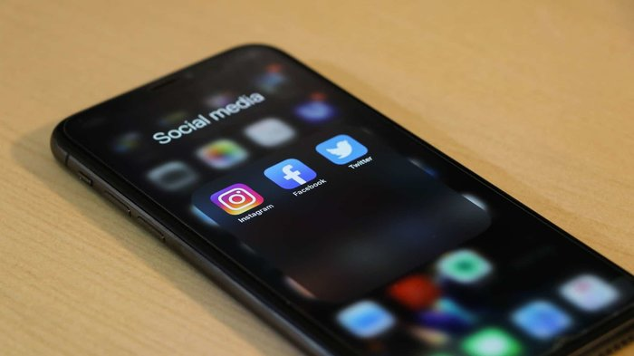

Živimo u vremenima gdje se više-manje sve obavlja uz pomoć računala i internetske veze: kupovina, plaćanje računa, komunikacija, učenje novih vještina... I sve se više i više glazbenika i stvaratelja sadržaja okreće internetu kako bi zaradili za život i nije teško vidjeti zašto. Ovaj članak će objasniti neke načine na koji se može zaraditi malo love „sa strane“, pa čak i cijelu plaću Vašom glazbom preko interneta.

**Upozorenje**: ovaj članak nije za naučiti kako svirati neki instrument, pjevati ili pisati pjesme. Pretpostavit će se da to već znate i ako ne znate, počnite učiti. Jedna stara izreka kaže: „Najbolje vrijeme za posaditi jabuku je prije 3 godine. Drugo najbolje vrijeme je danas.“

**Dakle, započnimo.**

Prije svega, prođimo malo stari, „old school“ način zarađivanja od pjesama: potpisivanje ugovora s izdavačem. Svirate u bendu ili ste solo umjetnik. Imate dobru kolekciju pjesama koju počnete izvoditi pred publikom i stvorite stalne slušatelje. „Lovac na glave“ vas primijeti, dogovorite sastanak s nekim šefom u izdavačkoj kući koji vam napravi ponudu. Ako je ona dobra, potpišete ugovor. Čini se vrlo jednostavno. Pa, hajmo malo u detalje.

Vjerujem da je sigurno za pretpostaviti da niste Backstreet Boys ili Taylor Swift. Takvi ljudi imaju ogromnu publiku i oni su, u suštini, „ziceri“. Oni jako puno zarađuju svojim izdavačima i puno prije će dobiti dobru ponudu. Štoviše, oni mogu koristiti svoju slavu da prebace uvjete ugovora u svoju korist, što na laičkom jeziku znači da mogu pregovarati. Vi i vaš bend s kojim svirate u garaži, koliko god on bio dobar, ne možete. Za vas je: uzmi ili ostavi, što nije nužno loše (vratit ćemo se na to). Još jedan razlog zašto izdavači odabiru velike izvođače je trošak oglašavanja. Procjenjuje se da je potrebno $500.000- $2.000.000 godišnje ZA JEDNOG IZVOĐAČA da ga se probije. Ako niste išli na popravni iz matematike, onda razumijete zašto izdavači ne žele kockati s malim umjetnicima, koliko god oni bili dobri i talentirani.

## Budite pažljivi prilikom potpisivanja ugovora

Izvor: Cyton Photography, Unsplash

A sad da popričamo malo o vašoj strani priče jer, na kraju krajeva, i vi želite zaraditi na svom radu. Nećemo toliko u detalje, ali ne plate vas koliko mislite ako ste pod izdavačem. Oni posjeduju prava na vaše pjesme (čak ni Beatlesi ne posjeduju prava na NJIHOVE pjesme) što je razlog zašto su neki izvođači tužili svoje izdavače, Kanye West je najnoviji primjer.

Također, ako napravite nešto što se nekom šefu ili direktoru ne sviđa (ponekad stvarno traže „dlaku u jajetu“), oni mogu „zakopati“ vaše izdanje pod drugima što znači da vas publika neće čuti, što znači da se albumi neće prodavati, što znači da nećete ništa zaraditi (to se dogodilo Joan Jett u 80-ima). Steve Vai je rekao da je prvi put zaradio dobre novce od njegovog nezavisnog albuma „Flex-able“. Čak je i Prince rekao da ako može dati ikakav savjet mladim umjetnicima, to je: „Ne potpisuj!“ zbog svih problema koje je imao s izdavačkim kućama (da, čak i Prince).

Na koncu, postoje mnogi načini kako izdavači mogu prevariti umjetnike i, naravno, neki od njih će to pokušati. Zato što mogu.

Ali, ima nade. Postoje tisuće umjetnika diljem svijeta koji su pokazali prst izdavačima i pošli svojim putem. Imamo pristup cijelom svijetu kroz magiju interneta, što znači da možemo sve što može izdavač, ali za same sebe, ne za nekog direktora izdavačke kuće.

## Što učiniti kako bi krenuli zarađivati?

Prije svega, morate imati dobre pjesme. Ako su vam pjesme loše, nitko ih ne želi čuti. Uložite vrijeme i trud u pisanje dobrih pjesama i sviranje/pjevanje da bi stvorili nešto što ljudi žele slušati. Također, morate i nekako snimiti te pjesme, ali ne morate za to ići u najskuplji studio na svijetu. <a href="https://www.youtube.com/user/SpectreSoundStudios" target="_blank" rel="noopener noreferrer">Evo linka jednog YouTube kanala</a> preko kojeg sam puno naučio o snimanju i produkciji .

Nakon što snimite pjesme morate ih izbaciti u svijet. Izađite i svirajte uživo. Stvorite publiku i veze. Idite na sajmove i skupove gdje možete upoznati promotore, menadžere, producente i slično. „Ali to nije preko interneta!“ Da, jasno mi je, ali saslušajte me! Što više svirate uživo, više će ljudi znati za vas. Što više ljudi zna za vas, više će ih biti spremno da zbilja kupi nešto što ste stvorili, PARAMA! Ovo je vrlo društveno zanimanje i najbolji način da stvorite veze je i dalje stvaran svijet.

Trebali biste imati nešto _mercha_ sa sobom, obično majice (drugi oblici mercha su dostupni, naravno). Napravite fora dizajn, isprintajte ih (opet govorim, morate znati ljude s printerima za majice, izađite i upoznajte ih) i izložite ih na eventu gdje svirate. To vama zarađuje novac i publici daje nešto od značaja.

## Natrag na internet!

Ima odličnih prilika da se zaradi ovdje. Osobito za vrijeme pisanja ovog članka (epidemija koronavirusa) jer su svi doma i žele neku vrstu zabave i razbibrige.

### Društvene mreže

 Izvor: Dole777, Usnplash

Kako izbaciti stvari? Napravite račun na socijalnim mrežama (Facebook, Twitter, Instagram, YouTube, što god vam srce želi) za dijeliti zanimljiv sadržaj s drugim ljudima. Tako i promovirate sebe i vaše proizvode. Možete napraviti Facebook promociju na ciljanu publiku za ne toliko puno love, dobro ovo iskoristite. Također razmislite o stvaranju videa za YouTube (ne samo spotove, nego i, recimo, obrazovne ili smiješne videe, ili što god vaša publika smatra zanimljivim) jer tome su se mnogi ljudi okrenuli ovih dana. To je super platforma za dijeljenje sadržaja ali i dobar način da se zarade pare.

„A što s iTunes-om ili Spotify-em?“ Odlično pitanje. Postoje platforme i za to, kao npr. Distrokid ili Tunecore (naravno da postoje i druge, istražite malo). One stave vašu glazbu na te stranice, kao i na mnoge druge.

### Bandcamp

<a href="https://bandcamp.com/" target="_blank" rel="noopener noreferrer">
Evo jedne odlične stranice za započeti</a>, čak možda i prije gore navedenih platformi. Puno ljudi ju koristi, ali funkcionira na principu donacija. Pjesme su na stranici i svi ih mogu slušati besplatno. Ako se ljudima svide pjesme, mogu vam nešto donirati ili kupiti majicu (ili štogod imate izloženo). Moguće je donirati sve od par kuna do, pa, nebo je granica!

### Patreon

<a href="https://www.patreon.com/" target="_blank" rel="noopener noreferrer">Ova platforma nije striktno glazbena</a>. Ona, doduše, omogućava da na vašoj stranici objavljujete sadržaj za različite razine mušterija, npr. nešto može biti dostupno svima, sljedeća razina (možda 20 kn mjesečno) ima pristup određenim videima ili izbačenim dijelovima sa snimanja. Sljedeća razina (za više love, logično, recimo 100 kn mjesečno) dozvoljava vašim fanovima pristup privatnom koncertu na Skype-u. Ili štogod. Slobodno uđite s idejama.

Više o Patreon-u možete pročitati u <a href="https://www.luckyisgood.com/blog/patreon/" target="_blank" rel="noopener noreferrer">
ovom članku</a>.

### Fiverr

Ako ste zbilja odličan glazbenik, <a href="https://www.fiverr.com/" target="_blank" rel="noopener noreferrer">napravite profil na Fiverr-u</a> i svirajte na pjesmama drugih ljudi, za pare, naravno. No imajte na umu da je to poprilično zasićeno tržište s puno talentiranih ljudi. Nemojte biti razočarani ako vas nitko ne zove.

### Evo jedne ideje

Ako već imate vjerne fanove, napravite ograničenu seriju box-seta koji sadrži jedan ili više vaših albuma, majicu, šalicu ili bilo koji komad mercha, kao i rukom napisanu poruku na kojoj piše zahvala ili neka pjesmica. Ili napravite neki micro art. Napravite kutiju komadom umjetnosti. Budite kreativni i originalni, napravite nešto što nitko nikada nije. Napravite nešto što se ističe i po čemu će vas ljudi pamtiti.

## Koliko novca trebam uložiti?

Ovisi. Nema jednog zadanog iznosa. Izrada računa je više-manje besplatno, možda neke dodatne mogu koštati. Nabava opreme je zbilja najveći trošak koji također, ovisi. Želite li nešto početno (imajte na umu da početno ovih dana ne znači sr\*nje) ili nešto za koju razinu više? Ovo se odnosi na instrumente, interface- ove, računalo, softver, mikrofone, studijske monitore (trebaju vam, nemojte miksati na slušalicama) i bilo koji drugi trošak koji se može pojaviti.

Ovih dana možete složiti kućni studio za nekih 6500-8000 kuna, i čak ne morate kupovati sve da bude početna oprema. Naravno da to nije malen iznos, ali to je jednokratna investicija. Kada se vaša karijera razvije možete uložiti u nešto skuplje i sjajnije. Bacite oko na ranije spomenuti Spectre Sound Studios za više informacija na ovu temu.

Mogao bih o ovome laprdati danima. Zbilja nema jednog zadanog iznosa, sve je individualno. Istražujte, uvijek istražujte! Izmjeri dvaput, reži jednom.

## OĆU PARE!!!

Koliko se može zaraditi ovako? Postoje nekoliko varijabli koje treba uzeti u obzir: gdje živite, što ste odlučili da bi radili i koliko rada uložite u to. Sa globalnim dosegom koji nam je omogućio internet, lokacija nije toliko čak ni bitna, no to spominjem zbog poreza i drugih obveza prema državi i drugim institucijama. Istražite porezne politike vašeg mjesta gdje živite i razgovarajte sa stručnim računovođom ili poreznim savjetnikom.

Kad ste to riješili, onda idite i pametno ulažite u vašu novopečenu karijeru (nemojte spiskati sve na aute i žene). Na ovaj način možete zaraditi sve od nekog prihoda sa strane (kao paušal) do profesionalnog stvaratelja sadržaja (kao jedini posao/zanimanje). No, analizirajući sadašnje glazbenike, saznajemo da svatko od njih radi više od jedne stvari, što znači da ne rade SAMO videa za YouTube ili nisu SAMO u bendu. Oni rade nekoliko tih stvari i tako su diverzificirali svoj izvor zarade.

Jasno mi je da nisam ama baš sve obradio u ovom članku. Da sam krenuo tako, ovo bi se pretvorilo u memoar i čitateljima bi postalo vrlo dosadno, vrlo brzo. To sigurno ne želim. Samo sam htio obasjati neke načine kako se može i TREBA zarađivati od glazbe na internetu. Ostavite komentar i kažite što sam rekao krivo ili ako vam se ovo doista svidjelo. Zapamtite, budite kreativni, originalni, uložite potreban rad i prije svega, zabavite se.

## O autoru

Andrian Nimac je student na <a href="https://www.efri.uniri.hr/" target="_blank" rel="noopener noreferrer">Ekonomskom fakultetu Sveučilišta u Rijeci</a>. Svira <a href="https://www.facebook.com/fanaaband/" target="_blank" rel="noopener noreferrer">bas gitaru u bendu Fanaa</a> i aktivno prati i uči o glazbenoj industriji kao i o modernoj tehnologiji i automobilskoj industriji.

Andriana možete pratiti na <a href="https://www.linkedin.com/in/andrian-nimac-7745361b6/" target="_blank" rel="noopener noreferrer">njegovom LinkedIn profilu</a>.

## Ako želite i dalje čitati o financijama, investiranju i ekonomiji zapratite blog na <a href="https://www.facebook.com/Pri%C4%8Dajmo-o-novcu-103037651540688" target="_blank" rel="noopener noreferrer">Facebook-u</a> i <a href="https://www.linkedin.com/in/dorian-ante%C5%A1i%C4%87-5255361a0/" target="_blank" rel="noopener noreferrer">LinkedIn-u</a>.
