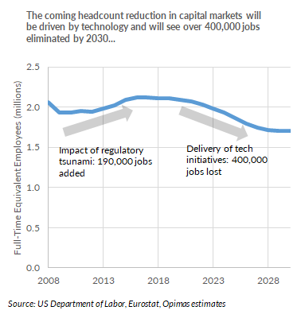
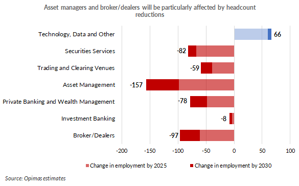

Financije kao i svaka druga funkcija u poduzeću prolazi kroz svoje promjene. Tehnološki napredak, nove stvari, modeli i načini poslovanja nisu i ne mogu zaobići financije niti poslove koji spadaju pod njom. Budući poslovi u financijama, uloga financijaša u poduzeću i potrebne vještine koje će financijaši morati svladati bitno će utjecati na uspjeh pojedinca i organizacije u kojoj se on nalazi.

<a href="https://www.weforum.org/projects/reskilling-revolution-platform/" target="_blank" rel="noopener noreferrer">Svjetski ekonomski forum</a> očekuje da će oko 75 milijuna poslova biti zamjenjeno zbog automatizacije i tehnološke integracije, ali će također ova transformacije stvoriti potražnju za 133 milijuna novih poslova sa novim prilikama. Skoro će se polovica vještina koje se smatraju “teškim” (hard skills) promijeniti, a pozitivan ishod transformacije će zahtjevati vještine koje se trenutno se izučavaju kroz postojeći obrazovni sustav.

Ako se nalazite u financijskog industriji, radite u financijskom odjelu ili ste još student financija potrebno je da pratite kako tehnologija utječe na ovo područje kako ne biste bili jedan od onih koji se neće uspjeti prilagoditi novim situacijama i koji neće prosperirati. U nastavku ću prikazati određena područja koja se tiču pripremanja za budućnost financija i kako poslovi u financijama mogu izgledati.

Budući da ću uskoro započeti svoju posljednju godinu magisterija na Ekonomskom fakultetu u Rijeci gdje studiram financije i bankarstvo interesiralo me hoću li imati sve potrebne vještine nakon završetka fakulteta kako bih mogao konkurirati ne samo hrvatskoj populaciji nego i svjetskoj. Osim toga htio sam vidjeti koji sektori će najviše profitirati u četvrtoj industrijskoj revoluciji, koji poslovi u financijama će nestati, a koji će biti traženi. Financije su široki pojam unutar koje ima mnogo smjerova gdje karijera može otići. <a href="https://www.mergersandinquisitions.com/is-finance-a-good-career/" target="_blank" rel="noopener noreferrer">Lako se izgubiti...</a> Kako ne bih upao u <a href="https://www.youtube.com/watch?v=VO6XEQIsCoM&t=2s" target="_blank" rel="noopener noreferrer">paradoks odluke</a> kada završim faks (od mnogo izbora ne izaberem ništa) odlučio sam unaprijed istražiti što čeka financije u budućnosti kako bi znao u kojem pravcu istraživati.

## Uloga financijaša u poduzeću

Za početak vidjeti ćemo kako će izgledati funkcija financija u poduzeću u budućnosti. Ovo “u budućnosti” ipak treba uzeti malo sa zrnom soli budući da nitko ne može reći sigurno što će biti, a i teško je odijeliti “sadašnjost” od “budućnosti” kada se uzme da razna poduzeća posluju na razne načine te da neka poduzeća već posluju ovako dugi niz godina.

Glavni posao financijaša biti će prilagodba novim tehnologijama, prepoznavanje prilika i kvalitetno upravljanje troškovima. Financijski direktor (CFO) dobiva novu ulogu poslovnog stratega poduzeća gdje preuzima sve više vodeću ulogu u kreiranju politika poduzeća tako što kontinuirano prati u kojem se smjeru tehnologija kreće i kako je iskoristiti za boljitak organizacije. Deloitte, jedna on najvećih organizacija za profesionalne usluge (poznata kao dio Big 4) u suradnji s <a href="https://deloitte.wsj.com/cfo/2019/02/03/preparing-for-the-future-of-finance-now/" target="_blank" rel="noopener noreferrer">The Wall Street Journal</a> odražao je niz predavanja te objavili članke o budućnosti financija, točnije kako će financije izgledati u 2025. godini.

Izvor: Adeolu Eletu on Unsplash

Kako bi znali kako će poslovi u financijama izgledati i kako će se financijski direktori prilagoditi promjenama Deloitte je iznio nekoliko mega trendova koji utječu na digitalnu strategiju organizacija:

**Eksponencijalni rast u podacima.** Strukturirani i nestrukturirani podaci mogu se koristiti u analizi kako bi se poboljšao proces donošenja odluka.

**Smanjenje računalnih troškova.** Sa sve većim prihvaćanjem računarstva u oblaku (pružanje IT infrastrukture kao što je prostor za pohranu podataka ili aplikacijski softver kao uslugu putem Interneta) poduzeća mogu pristupiti većim računalnim prostorima po nižim troškovima nego prije.

**Pametniji algoritmi.** Algoritmi omogućavaju brže i detaljnije procese te analiziranje podataka kako bi se što više povećala vrijednost unutar poduzeća.

**Veća brzina obrade.** Transakcije se mogu obrađivati nikada brže što omogućava kvalitetnije donođenje odluka.

<a href="https://www2.deloitte.com/uk/en/profiles/davidjanderson.html" target="_blank" rel="noopener noreferrer">David Anderson</a>, Deloittov voditelj strategija i operacija u financijama za Ujedinjeno Kraljevstvo, iznio je osam predikcija <a href="https://deloitte.wsj.com/cfo/2018/07/18/reimagining-finance-talent-for-industry-4-0/?mod=Deloitte_cfo_relatedcontent" target="_blank" rel="noopener noreferrer">kako bi financije mogle izgledati u 2025. godini.</a>

1. **Tvornica financija.** ERP sustavi, blockchain tehnologija, automatizacija sve vodi prema tome da će ručni radovi koji su se obavljali u poslovima u financijama prestati vršiti ljudi te će se oni prebaciti u kreativniji dio, strategijsko razmišljanje. Fokus financija preusmjerit će se na dizajn, konfiguraciju i održavanje sustava.

2. **Uloga financija.** Kako će se operacije automatizirati, fokus financija prelazi na davanje detaljniji uvida poduzećima i pružanja diferenciranih usluga kupcima te djelujući kao stratezi. Očekuje se da će financije više raditi razna planiranja scenarija koristeći naprednu analitiku za rješavanje problema i pružanja prediktivnih kapaciteta. Iz pasivnog analiziranja prošlih brojeva prelazi se u aktivno analiziranje podataka kako bi se poduzeće napravilo što pametnijim.

3. **Financijski ciklusi.** Periodičko izvještavanje zamijeniti će kontinuirano praćenje prodaje, novčanih tokova i zaliha. Obrađivanje u stvarnom vremenu zahtijevati će da radna snaga ima razvijeno analitičko znanje i programiranje kako bi mogli kvalitetno iskoristiti prikupljene podatke.

4. **Samoposluga.** Virtualni asistenti, chatbotovi i ostali digitalni alati omogućuju brzo dolaženje do potrebnih podataka i dokumenata. Organizacije će nastaviti ulagati u ovo područje kako bi mogle biti brže u obavljanju posla.

5. **Operativni model financija.** Sve više posla obavljati će se u suradnji ljudi, robota i algoritma. Rasti će poslovi organizirani kao projekti, a za kvalitetnu obradu morati će se raditi na povećanju suradnje između više zanimanja/funkcija, primjerice robotike, blockchaina i kognitivnih tehnologija.

6. **ERP.** ERP sustav (Enterprise Resource Planning System) poslovni informacijski sustav koji omogućuje potpunu kontrolu nad poslovnim procesima u poduzeću. Računovodstvo, ljudski resursi, odnos s klijentima, prodaja – glavna odlika ERP je da svime upravlja iz iste baze podataka, pružajući tako priliku različitim poslovnim sektorima da dođu do njima relevantnih podataka. Poduzeća sve više prelaze na računarstvo u oblaku (cloud) što istiskuje potrebu da se svi sustavi prebace na oblak kako bi organizacija iskoristila maksimum takvog načina rada i smanjila troškove. Povezivanje raznih sustava dovesti će do bržih prikupljanja podataka i time i bržeg i kvalitetnijeg donošenja odluka.

7. **Podaci.** Veliko i brzo prikupljanje podataka dovst će do potrebe pronalaženja pravih podataka i fokusa na njih koji će povećati vrijednost poduzeću. Važno će biti ne izgubiti se u silnim podacima, a to će dovesti do potrebe zapošljavanja stručnih ljudi ili obučavanja postojećih zaposlenika.

8. **Odnos radne snage i radnog mjesta.** Kombinacija svih ovih velikih promjena zahtjevati će od financijskih direktora konstantno obučavanje zaposlenika, uvođenja novih vještina u funkciju (poslovna analiza, znanost o podacima, pripovijedanje izvješća). Rutinski poslovi prelaze u odgovornosti temeljene na znanju te se također mijenja pristup poslu gdje financijaši više nisu u pozaditi poduzeća nego sve više prelaze na prvu crtu gdje će ispunjavati potrebe kupaca i stvarati te pronalaziti nove prilike.

Očekuje se da će donošenje odluka temeljenih na analitičkim vještinama biti temeljna vještina za buduće financijske timove te će se financijski direktori morati prilagoditi tim uslovima.

## Budućnost - poslovi u financijama

Poslovi u financijama mijenjaju se u skladu s tehnologijom. Automatizacija, AI i razni digitalni alati smanjuju potrebu za radnom snagom na području zadataka koji su radno intenzivni, ali istovremeno stvara potrebu za ljudima koji su visoko obrazovani. Oni bi morali znati kako iskoristiti nova saznanja i upotrijebiti ih što efikasnije.

Izvor: Chris Ried on Unsplash

Prema istraživanju američkog biroa za statistiku pet je postojećih karijera unutar financija koji će doživjeti rast od 6% na više za razdoblje od 2018 - 2028.

Za poziciju <a href="https://www.bls.gov/ooh/management/financial-managers.htm" target="_blank" rel="noopener noreferrer">financijskog menadžera</a> očekuje se da će imati najveći rast od 16% što je znatno više od prosjeka od 5,2% što vrijedi za ostala zanimanja. Nakon njega slijedi <a href="https://www.bls.gov/ooh/business-and-financial/management-analysts.htm" target="_blank" rel="noopener noreferrer">menadžerski analitičar</a> (nadam se da sam dobro preveo) za koji se predviđa 14% rast, ponajviše zbog rastuće konkurentnosti i globalizacije. Treće mjesto po rastu zauzima <a href="https://www.bls.gov/ooh/business-and-financial/loan-officers.htm" target="_blank" rel="noopener noreferrer">kreditni službenik</a> kojemu se predviđa rast od 8%. Predviđeni rast od 7% pripisuje se poziciji <a href="https://www.bls.gov/ooh/business-and-financial/personal-financial-advisors.htm" target="_blank" rel="noopener noreferrer">osobnog financijskog savjetnika.</a> Peto mjesto od 6% po predviđenom rastu zauzima pozicija <a href="https://www.bls.gov/ooh/business-and-financial/accountants-and-auditors.htm" target="_blank" rel="noopener noreferrer"> računovođe ili revizora</a> što je otprilike slično prosjeku svih zanimanja.

### 6 futurističkih poslova u financijama

Web stranica <a href="https://thenextweb.com/future-of-finance/2019/09/02/6-futuristic-jobs-that-will-soon-exist-in-the-financial-industry/" target="_blank" rel="noopener noreferrer">thenextweb.com</a> napravila je zanimljivi intervju s voditeljem odjela za iskustvo zaposlenika (Chief Employee Experience Officer) nizozemske banke ABN AMRO Frankom van den Brinkom. Prema trendovima koje prati dao je predviđanja koje će pozicije unutar financijske industrije biti uskoro bitne i koji će poslovi u financijama moguće nastati:

1. **Fintech headhunter.** Fintech startupovi donose svježinu u financijsku industriju i zbog toga ih ljudi najviše percipiraju kao pozitivne i dobrodošle. Banke opadaju u <a href="https://www.bbva.com/wp-content/uploads/2015/08/millenials.pdf" target="_blank" rel="noopener noreferrer">javnom mnijenju</a> kao glavni i prvi izvor financijskih usluga. Zbog ovoga nastaje potreba da banke nove startupove ne gledaju kao konkurenciju nego kao moguće partnere te ih akviziraju ili surađuju s njima. Također, banke će moći unuar svojih organizacija organizirati startupove te se na taj način prilagoditi tržištu (odličan primjer kod nas je KEKS Pay od Erste banke).

2. **Samoinicijativni financijski inženjer (Self-driving finance engineer).** Financijska usluga poput upravljanja portfeljem prije je bila dostupna samo onima koji su imali značajni iznos novca kojim bi financijski savjetnici ili menadžeri upravljali, ali sada s pojavom raznih digitalnih alata poput robotskih savjetnika to više nije tako. <a href="https://qz.com/1311135/credit-karma-ceo-ken-lin-says-autonomous-money-will-be-here-in-five-years/" target="_blank" rel="noopener noreferrer">Upravljanje novcem postaje automatizirano</a> i to drastično smanjuje troškove te povećava dostupnost većem broju ljudi. Raste potreba za ljudima koji će osmišljavati takve programe i znati ih što bolje iskoristiti.

3. **Upravitelj održivog bogatstva (Sustainable wealth manager).** Svijet prelazi na zeleno, to je trend koji će samo rasti. Od državnih politika, politika poduzeća, odluka kućanstva itd. svi se usmjeravaju na odgovorniji pristup prirodi. Kućanstva ugrađuju solarne panele, država daje poticaje za električne automobile, porezi na CO2 itd. Sve ove mjere utječu na finacije te će biti potrebno znati kako najbolje iskoristiti mjere koje vlade pružaju, kako najefikasnije postaviti primjerice panele (i koliko točno njih), koliko možemo proizvesti ugljikovog dioksida, a da zakon ne prekršimo zakon i razne druge stvari.

4. **Prognoziranje kripto trendova (Cryptoforecaster).** Kriptovalute su i dalje tu te ne planiraju nestani. Bitcoin je pokrenuo industriju koja svake godine sve više i brže raste. Ovo područje je još previše mutno za velike investitore i banke te su im potrebni ne ljudi koji znaju napraviti kriptovalute nego ljudi koji znaju primjeniti tu tehnologiju i koji se znaju kretati unutar zakonskih okvira.

5. **Povjerenik (Trust officer).** Zbog ogromnih količina osobnih podataka koje organizacije prikupe o svojim korisnicima države i međunarodne organizacije su uvele razne regulative koje se moraju ispoštovati kako bi se (navodno) zaštitili korisnici (najpoznatiji za nas je GDPR). Banke i ostale financijske organizacije moraju poštivati te zakone kako ne bi došli u sukob s politikom te bili novčano kažnjeni.

6. **Kibernetička sigurnost i povezivanje s drugim organizacijama.** Kako i samo ime kaže rasti će potreba da organizacije međusobno surađuju kako bi ojačale svoje sustave za kibernetičku sigurnost i osigurale podatke svojih klijenata te vlastite.

### 4 fintech trenda koji će povećati poslove u financijama

Osim poslova “budućnosti” kako bi se što kvalitetnije pripremili za nove realnosti unutar financija potrebno je i pratiti trendove koje postavljaju mlada poduzeća fintecha. <a href="https://qz.com/1311135/credit-karma-ceo-ken-lin-says-autonomous-money-will-be-here-in-five-years/" target="_blank" rel="noopener noreferrer">PageGroup</a>, organizacija za regrutaciju bazirana u Ujedinjenom Kraljevstvu, napisala je članak od 4 trenda koji dolaze s fintech scene koji će povećati poslove u financijama:

1. **Blockchain.** Blockchain tehnologija može se koristiti u bilo kojoj industriji koja želi osigurati razmjenu podataka. Budući da banke raspolažu sa ogromnim količinama podataka nad kojima postoji mnogo regulacije sve više njih ulaže u ovu tehnologiju kako bi osigurala da u budućnosti ne izgubi dio prihoda od startupova koji bi mogli ponuditi bolji proizvod ili uslugu.

2. **Roboti investitori (Robo advisors).** Roboti investitori su vrsta automatizirane usluge investiranja koji upravljaju financijskom imovinom, najčešće kupovinom ETF-ova i indeksih fondova. Njihova usluga je daleko jeftinija od investicijskih menadžera i zbog toga su sve privlačniji ljudima. Prinosi im najčešće pokušavaju oponašati tržište (S&P 500 indeks kao najpoznatiji). Rast ove industrije znači da će rasti potražnja za softver inžinjerima, front i back-end programerima i profesionalcima za cyber sigurnost. Naravno ako ljudi idu sve više prema ovom načinu investiranja znači da manje idu prema aktivnim fondovima u kojima rade investicijski menadžeri tako da će se ta industrija morati prilagoditi. Više će se ići na personalizirano savjetovanja, na dugi rok, sastavljanje sveobuhvatnih planova i bolje upoznavanje s klijentima.

3. **Mobilni novčanici.** Mobilni novčanici kao što se može shvatiti iz naziva su zapravo aplikacije unutar koje se se nalazi vaš novac, bilo direktno na njima ili povezano s bankama, i koji omogućuju plaćanje putem mobilnog uređaja. Trend uporabi ovih novčanika je rastući.

4. **Peer to peer krediti.** Također poznato kao P2P, direktno je posuđivanje novca od zajmodavca prema dužniku. Kako ova poduzeća svu svoju djelatnost obavljaju online ono im omogućava da svoje troškove smanje na nižu razinu od običnih kreditora te tako ponude bolje uvjete zajma.

## Potrebne vještine za poslove u financijama

Nakon što smo obradili promjene u financijskoj industriji koje se najviše tiču tehnologije te prikazali određene trendove, a i “poslove budućnosti” sad je na redu da ukratko razjasnimo koje se vještine traže od financijaša, ponajviše od studenata.

Prema istraživanju <a href="http://www.opimas.com/research/472/detail/" target="_blank" rel="noopener noreferrer">konzultantskog poduzeća Opimas</a>, do 2030. godine nekih 400.000 radnih mjesta će se izgubiti na tržištu kapitala zbog utjecaja tehnologije.

<strong>Graf 1:</strong> Broj zaposlenika od 2008. do 2030. godine

Izvor: opimas.com

Radna mjesta koja će najviše biti pogođena su ona u sektoru upravljanja imovinom, brokeri i usluge vrijednosnih papira. Jedino će sektor tehnologije i podataka imati rast i to veliki unutar tržišta kapitala.

<strong>Graf 2:</strong> Pad broja zaposlenika procjenjeno prema vrsti institucija

Izvor: opimas.com

Kao što ste mogli kroz cijeli ovaj članak zaključiti, tehnologija utječe i na potrebne vještine koje će financijaši morati svladati. <a href="https://www.ft.com/content/6c7001ec-70e3-11e9-bf5c-6eeb837566c5" target="_blank" rel="noopener noreferrer">Financial Times</a> piše da više poznavanje Excela nije ni približno dovoljno kako bi se konkuriralo na tržištu, potrebno je svladati programske jezike poput R, Pythona ili nekog drugog koji se može primjeniti u financijskoj industriji.

Osim poznavanja tehnologije, financijaši moraju sve više raditi na <a href="https://www.theoutperformer.co/post/the-future-of-the-finance-profession-a-cfo-perspective" target="_blank" rel="noopener noreferrer">strategijskom promišljanju, osmišljavanju novih procesa, dizajna, timskom radu</a> sve kako bi ojačali svoje “meke” vještine. Rad u pozadini polako prelazi u rad na prvoj crti, s klijentima, direkti rad na strategijama unutar poduzeća.

Studenti moraju raditi na tome da razvijaju svoje meke vještine, uče o financijama i poslovanju, ali ne smiju nikako zanemariti tehnološku stranu. Napredno poznavanje Excela i učenje programskih jezika postaje standard, a ne iznimka.

Za detaljnije informacije o potrebnim vještinama pročitajte <a href="https://www.ibf.org.sg/programmes/Pages/Future%20of%20Finance%20Jobs%20Study.aspx" target="_blank" rel="noopener noreferrer">ovdje.</a>

## Zaključak

Financijska industrija brzo se mijenja. Ono što znamo sada o budućnosti možda neće biti isto što nas dočeka za <a href="https://www.siliconrepublic.com/careers/huy-nguyen-trieu-fintech-jobs-finance-sector" target="_blank" rel="noopener noreferrer">10 godina.</a> Možda niti za 5. Jedina stvar za koju možemo biti sigurni je ta da nam obrazovanje ne smije stati. Kako industrija ide prema naprijed tako moramo i mi ići. Nikada u drugom smjeru jer to znači da ćemo zaostati i nećemo se uspjeti na vrijeme prilagoditi. Učite, učite i učite. Birajte kvalitetne izvore informacija, one koji ulože trud i vrijeme u istraživanje i pisanje. Nemojte gubiti vrijeme na jeftine naslove iz portala koji pišu sve i svašta samo da bi ih ljudi otvorili kako bi mogli kasnije prodati reklamni prostor za više novca.

Do drugog puta, nek Vam i dalje venama teče krv kapitalizma, a mi se čitamo kasnije!

Dorian Antešić

Ako želite i dalje čitati o financijama, investiranju i ekonomiji zapratite <a href="https://www.facebook.com/Pri%C4%8Dajmo-o-novcu-103037651540688" target="_blank" rel="noopener noreferrer">Facebook</a> i <a href="https://www.linkedin.com/in/dorian-ante%C5%A1i%C4%87-5255361a0/" target="_blank" rel="noopener noreferrer">LinkedIn</a> stranice bloga. 
-