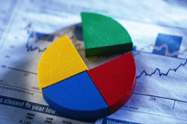

Razmišljajući o recesiji nedavno, počela sam se osjećati pomalo uplašeno za svoju budućnost. Upravo je to bio razlog zbog kojega sam krenula u potragu za najboljim načinima za **uštedjeti i pripremiti se za sljedeću recesiju**.

## Što je recesija i kako se pripremiti za nju?

**Važno je razumjeti kako je recesija samo normalan dio poslovnoga ciklusa i kako se događa u prosjeku svakih 7 do 10 godina.** Ekonomisti za nju kažu kako je to povremeni ekonomski pad tokom kojega su smanjene razmjena i industrijska aktivnost, što se očituje u padu BDP-a u dva susjedna kvartala. Recesija može biti globalna kao što je bila Velika recesija, ali može zadesiti i neku specifičnu zemlju ili industriju.

**Unatoč tomu što većina ljudi razumije što je recesija, mnogi se i dalje ne znaju pripremiti za nju i postati financijski snažniji no što su bili prije. Nikada ne zaboravite kako je u svakoj recesiji i prilika, tržišta strme prema dolje, cijene su niske i, ako ste uštedjeli vaš novac, možete biti kao dijete u trgovini s igračkama.**

Dakle, evo nekoliko savjeta za pravilnu pripremu:

### 1. Kreirajte budžet

Ovo se možda čini dosadno, no ako se želite efektivno pripremiti za recesiju, potrebno vam je imati kontrolu nad svojim troškovima. <a href="https://www.antesic.com/kako-napraviti-budzet-i-poceti-stedjeti-osobne-financije/" target="_blank" rel="noopener noreferrer">Kreiranje budžeta je jedan od prvih koraka upravo zbog toga što vam pomaže racionalnije trošiti.</a>

Većina ljudi nema kontrolu nad svojim troškovima što je vidljivo u činjenici da većini ljudi na kraju mjeseca ostane ista količina novca, čak i kada im dohodak raste. To se događa jer više trošimo kada mislimo da imamo više novca, umjesto da višak spremimo sa strane i učinimo nešto korisnije s njim. Budžet je stoga savršen način za kontrolu takvoga ponašanja.

#### 1.1. Što je budžet?

**Budžet je vaš financijski plan koji uključuje vaš dohodak, te vaše troškove.** Ako nikada niste ovo radili, možete jednostavno započeti samo s praćenjem vaših troškova.

Za početak prikupite sve vaše bankovne izjave, račune koje plaćate i sve podatke koji se tiču vaših dohodaka i troškova. Pratite koliko novca potrošite tijekom mjeseca i na što ga trošite. Jednom kada prikupite ove podatke, razdvojite vaše troškove na fiksne i varijabilne.

**Fiksni troškovi su dio koji ostaje jednak svaki mjesec i ne možete izbjeći njegovo plaćanje. To su primjerice stanarina, hipoteka, račun za Internet ili rata kredita. S druge strane, varijabilni troškovi su oni koji variraju iz mjeseca u mjesec. Oni mogu uključivati kupovinu namirnica, goriva, odlazak u kino ili na večeru, bit je u tome da ih možete prilagođavati prema potrebama.** Kada završite s ovim djelom, bit će vam vidljivo jesu li vam troškovi manji od dohotka.

Poanta ovoga je uočiti troškove koji su vam nepotrebni kako bi mogli prilagoditi varijabilni dio tako da vam dohodak bude veći od troškova na kraju mjeseca. Dok to činite, možete se služiti Excel tablicom ili nekom aplikacijom za štednju koju možete imati na vašem laptopu ili telefonu. Neke od njih su Mint, PocketGuard, Personal Capital ili nešto drugo što vam najviše odgovara.

---

**Preuzmite besplatno tablicu za budžetiranje
<a href="https://docs.google.com/spreadsheets/d/1rE2q1abWOibWLvsZ0kQhH9JSBQsuQzixTn4OqAg3fLQ/edit?usp=sharing" target="_blank" rel="noopener noreferrer">50/30/20 model za Budžetiranje - Google tablica</a>**

**Nakon što preuzmete <ins>napravite kopiju i u njoj upisujte podatke</ins>**

## 2. Otplatite svoje dugove

Imati previše dugova može biti poprilično riskantno jer oni uzrokuju nižu likvidnost. Niska likvidnost je problem zato što vanjski faktori mogu utjecati na vašu mogućnost otplaćivanja dugova. Primjerice, poslodavac bi vam mogao sniziti plaću zbog recesije, te bi se mogli naći u financijskim problemima jer niste više u mogućnosti otplaćivati svoje dugove.

**Jednom kada ste oformili vaš budžet, trebate vidjeti koje nepotrebne troškove u varijabilnom djelu možete sniziti kako bi otplatili dugove brže.** Možda možete trošiti manje na namirnice, kupiti jeftiniji auto ili uzeti jeftiniju tarifu za mobitel. Ne postoji jedinstven odgovor na pitanje koje troškove sniziti, to ovisi o vama i vašem načinu života. Također, provjerite možete li povisiti svoj dohodak s nekim dodatnim poslom.

**Ako imate više dugova, prvo sav dodatan novac upotrijebite kako bi otplatili dug s najvišom kamatnom stopom.** Kad otplatite prvi dug, započnite s otplatom idućeg koji ima najvišu kamatnu stopu i nastavite prema istom principu sve dok niste otplatili sve. Možete koristiti i drugi način, a to je da prvo otplatite najniži dug i onda počinjete s otplatom viših. To je metoda kojom se brže rješavate svojih dugova prema broju dugovanja, ali to bi moglo uzrokovati više kamatne stope jer bi mogli završiti tako da otplaćujete dugove s najvišim kamatnim stopama na kraju.

## 3. Izgradite fond za hitne slučajeve

Fondovi za hitne slučajeve su izvori imovine kojima je lako pristupiti, a mogu pokriti tri do šest mjeseci vaših troškova. Ovi fondovi se koriste za hitne slučajeve i svrha im je pomoći vam nositi se s neočekivanim financijskim problemima u kojima bi se mogli naći. Oni su korisni ako izgubite posao, razbolite se ili se nađete u nekoj drugoj neočekivanoj situaciji. **Ovo je vrlo bitan faktor pripreme za recesiju budući da vas stavlja u puno bolju poziciju ako izgubite vaš redoviti dohodak.**

Možete, primjerice, vaš novac staviti na štednju s visokom kamatnom stopom kojoj je jednostavno pristupiti.

Dobar način na koji možete izgraditi fond za hitne slučajeve je odvajati određenu količinu vašeg dohotka svaki mjesec dok ne dođete do potrebne svote. Također, možete koristiti svoje povrate poreza za ovu svrhu, umjesto da ih samo potrošite. Između ostalog, možete i skupljati sitniš u kasicu prasicu, te ga prebaciti na štednju kada prikupite veći iznos.

**Ako vas dugovanja sprječavaju u štednji, trebali bi pokušati izgraditi fond koji će vam pokriti bar mjesec dana troškova života prije no što se usredotočite na otplaćivanje vaših dugovanja.**

## 4. Učinite vaš dohodak što raznolikijim

Većina ljudi vjeruju kako su njihove financije sigurne ako imaju redoviti posao koji pokriva njihove troškove. Ali što ako se dogodi da izgubite posao za vrijeme recesije? Što će se dogoditi ako poduzeće u kojemu radite propadne?

**Ljudi trebaju postati svjesniji prijetnji koje bi se mogle dogoditi neočekivano, najednom i bez upozorenja. Upravo to je razlog za širenje izvora vašeg dohotka jer više tokova vašeg dohotka znači veću razinu sigurnosti za vas.**

Postoji mnogo načina za prikupljanje više dohotka. Za početak, možete investirati novac u nešto. Ideja je učiniti da vaš novac radi za vas, te razviti kvalitetnu imovinu. Ako ste novi u investiranju, najbolja ideja je započeti s ETF-ovima ili dijeljenim fondovima jer su oni manje riskantni i ne zahtijevaju veliku količinu znanja poput, primjerice, dionica. Možete investirati i u nekretnine. To je moguće putem kupnje fizičke nekretnine tako da zaradu stvarate od iznajmljivanja ili prodaje iste. S druge strane, možete uložiti u Zakladu za ulaganje u nekretnine (REIT) i tako biti dio tržišta nekretnina bez posjedovanja jedne.

Osim investiranja, postoji mnoštvo opcija za vas. Možete potražiti povremeni posao ako imate vremena za njega. Danas postoji i mnogo načina za online zaradu koju možete ostvariti iz udobnosti svoga doma. Također, ako imate višak prostora u objektu u kojemu živite, možete ga iznajmljivati kako bi zaradili. Ako imate nešto za prodati, prodajte to. I razmislite o strastima koje imate i postoji li način da ih unovčite. Ako ste dobri u pisanju, napišite E-knjigu i prodajte ju online. Možete i ponuditi neku uslugu kao što je čuvanje djece, davanje instrukcija ili nešto što vam dobro ide.

Ovdje sam vam dala samo nekoliko ideja, ali svijet je pun mogućnosti. Bitno je samo proaktivno razmišljati i fokusirati se na postizanje cilja ulažući trud u ono što činite, te imati na umu kako je stvaranje dohotka iz raznolikih izvora najbolji način pripreme za recesiju.

## 5. Diverzificirajte vaš portfelj

**Što znači diverzificirati vaš portfelj?**

To znači kako bi vaš portfelj trebao sadržavati različite tipove imovine u različitim sektorima. Ako investirate samo u jedan sektor, mogli bi izgubiti sav novac ako recesija pogodi upravo taj sektor. Također, obratite pozornost da vam novac bude uložen u neke necikličke sektore budući da su oni otporni na recesiju.

**Kada razgovaramo o alokaciji imovine, pokušajte imati raznolike investicije poput nekretnina, dionica, obveznica, novca i sirovina.** Dionice se bolje ponašaju tijekom oporavka ekonomije, dok će vas obveznice zaštititi tijekom recesije. Sirovine i novac će vas zaštititi od inflacije, dok su dugoročne obveznice najbolja opcija za razdoblja deflacije. Bitno je balansirati vašom imovinom uzimajući u obzir rizike koje ste spremni prihvatiti, period u kojemu želite povrat, te količinu novca koju želite zaraditi.

Ako želite još više raznolikosti, možete ju postići i geografski, ulažući internacionalno, a ne samo u vašoj državi. No imajte na umu kako previše raznolikosti nije dobro, budući da se može dogoditi da vam investicije nisu dovoljno velike kako bi ostvarili kvalitetne povrate.

## 6. Posjedujte raznolik set vještina

Rad na vašim vještinama je poprilično značajan u pripremi za recesiju. Trebate uvijek raditi na njima kako bi vas bilo teže zamijeniti na vašem radnom mjestu. Najbolji način za praćenje vještina koje bi bilo korisno nadograditi je SWOT analiza.

**SWOT analiza je tehnika strateškog planiranja koja se koristi kako bi pomogla osobi ili organizaciji identificirati snage, slabosti, prilike i prijetnje povezane s poslovnom konkurencijom ili planiranjem projekta.**

Prvi korak je složiti popis vaših snaga i slabosti. Taj popis treba biti objektivna vježba bez emocija. Bit je u identificiranju svojih vrlina i mana budući da su to unutarnji čimbenici na koje vi možete utjecati. Važno je to učiniti iskreno i ispravno jer je to najbolji način da shvatite na kojim vještinama trebate poraditi.

Nakon što ste gotovi s prvim dijelom, analizirajte prilike i prijetnje koje imate u svom poslovnom okruženju. Na primjer, prilika može biti nova pozicija ili usavršavanje na radnom mjestu, dok prijetnja može biti nova tehnologija koja bi vas mogla zamijeniti ili nadolazeća recesija u vašem sektoru.

**Poanta je u praćenju snaga koje trebate steći kako bi povećali broj prilika i minimizirali prijetnje.** U ovom primjeru, možete naučiti kako upravljati s novim strojevima i tako prevenirati gubitak posla zbog robotizacije. Također, možete steći neke posebne vještine koje će vas učiniti nezamjenjivim u vašoj kompaniji.

Nakon što ste završili s vašom SWOT analizom, možete započeti s planiranjem vještina koje mislite unaprijediti. Najbolji način za započeti je razgovarati s vašim šefovima i radnim kolegama i vidjeti što oni misle. Možda će upravo oni znati najbolji način za unaprijediti željene vještine.

**Umrežavanje (networking) je isto tako veliki dio unaprjeđivanja vaših vještina.** Dobro bi bilo sudjelovati na što više seminara, konferencija i događaja na kojima se možete umrežiti s ljudima iz vaše industrije. Tako možete podijeliti vaša iskustva i vidjeti načine na koje drugi ljudi rješavaju takve probleme, upoznati drugačije perspektive, te naučiti nešto novo.

Na kraju, odlična je ideja nadopuniti vaš životopis polažući tečajeve. Pogledajte malo što se nudi u vašoj državi ili pokušajte s nekim online platformama. Neke od njih su Coursera, Udemy, Khan Academy, MIT OpenCourseWare, Stanford online,…

---

**Nakon svake recesije dolazi vrijeme još većeg širenja ekonomije kojemu se možemo radovati. A sada je vrijeme da stavimo fokus na pripremu za recesiju kako bi postali još uspješniji idući put kada se dogodi ekonomski krah. Sretno!**

## O autoru

Filipa Topčić studira Međunarodno poslovanje na <a href="https://www.efri.uniri.hr/" target="_blank" rel="noopener noreferrer">Ekonomskom fakultetu Sveučilišta u Rijeci</a>. Uživa u istraživanju ekonomije, financija i pisanja. Kroz volontiranje na projektima stekla je raznolike vještine i znanje potrebno da razumije poslovanje i spremno prihvati sljedeće izazove.

Filipu možete pratiti na njenom <a href="https://www.linkedin.com/in/filipa-top%C4%8Di%C4%87-55279b1a1/" target="_blank" rel="noopener noreferrer">LinkedIn profilu</a>.

---

Ako želite i dalje čitati o financijama, investiranju i ekonomiji zapratite <a href="https://www.facebook.com/Pri%C4%8Dajmo-o-novcu-103037651540688" target="_blank" rel="noopener noreferrer">Facebook</a> i <a href="https://www.linkedin.com/in/dorian-ante%C5%A1i%C4%87-5255361a0/" target="_blank" rel="noopener noreferrer">LinkedIn</a> stranice bloga. 
-