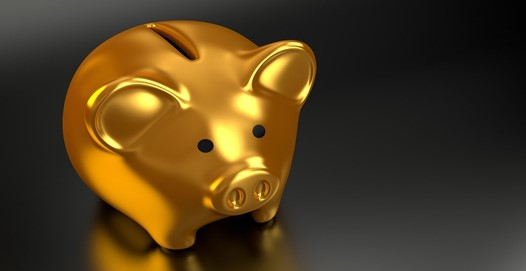

Pred više od 100 godina američki investitor i bankar John Morgan rekao je **„zlato je novac, sve ostalo je dug“**. Što je pod time mislio i zašto (ne) ulagati u zlato pročitajte u nastavku.

**\*Napomena**: tekst ne sponzorira niti jednog poslovnog subjekta koji se bavi prodajom zlata, već je nezavisan kako bi pružio uvid studentima ekonomije i drugim zainteresiranim pojedincima da ulažu u zlato i plemenite metale.

## Kako je to bilo prije

Zlato nije samo jedan običan metal u nizu. Prije svega taj plemeniti metal koristio se-i još uvijek se koristi-više tisuća godina za robnu razmjenu i nakit. Bio je predmet požude, ljudskog zadovoljstva i inspiracije mnogim umjetnicima. Kroz povijest valute su se rađale i propadale. Najčešći je uzorak tome inflacija ili dolazak neke jače i sigurnije valute (u Hrvatskoj će se to dogoditi kroz par godina kada kuna bude zamijenjena eurom). Međutim, zlato je, kao i doduše svi plemeniti metali, opstalo. Mnoge to ne fascinira. Mnogi znaju već sve napisano, no ipak uglavnom ista većina gotovo uvijek ostane skeptična po pitanju investicijskoga zlata. Kaže se da su ljudi skeptični prema onome što ne razumiju. No, nema razloga za brigu.

## Kako je to danas

Kako se razvija naše društvo kroz investiranje i inoviranje u tehnologiju i znanje dolazi do sve više znanja i napretka. S više znanja dolazimo do novih otkrića i lagodnijeg načina života. **Nedavno je baš u jednim medijima bilo napisano kako je razdoblje između 2010. i 2020. godine najbolje desetljeće u ljudskoj povijesti**. Barem je tako na Zapadu, ali sve više-vjerovali ili ne-u zemljama Trećega svijeta. To je sada već neka druga tema o kojoj bi se mogao napisati neki drugi članak pa neću ulaziti u nju. Zašto to govorim? Očito zato što danas biti nepismen **uglavnom znači izbor da to i budeš**. To se, doduše, odnosi samo na Zapad i nešto malo zemalja izvan njega **(generalno gledano na sam koncept zapadnoga svijeta u usporedbi s drugim dijelovima našega planeta)**. Rijetko tko (mada ih nažalost ima) danas može okriviti neke druge okolnosti za nepismenost. Danas imamo tolike mogućnosti za zaradu da vjerojatno ne možemo ni zamisliti kako su ljudi teško živjeli pred stotinu godina u vrijeme one izjave koju sam namjerno spominjao na početku.

## Investicijsko zlato

To je vrlo često zbunjujući pojam. **Investicijsko zlato, kao i uostalom svi plemeniti metali, nisu investicije u smislu kupoprodaje dionica na hrvatskome ili inozemnom tržištu**. Zlato niti puno dobiva niti puno gubi na vrijednosti. Ono nije dionica Tesle da se cijene mogu naglo spuštati ili naglo dizati (mada se može kupiti u obliku dionica). Doduše, nije da se tako nešto ne može dogoditi, već se događa jako rijetko u odnosu na neke kvalitetne dionice. Pogledajte razdoblje između 2010. i 2020. godine na tržištu zlata i cijene jedne unce (31,1035 grama). Cijena zlata nije toliko dobivala. Zapravo, više je gubila, ali zanemarivo. Da ste zlato kupili 2010. godine danas biste bili na pozitivnoj nuli. Zato sam namjerno rekao da se često shvaća ona riječ „investicijsko“, jer se ne radi o klasičnim investicijama. Riječ je zapravo o štednji na kojoj možete, ali i ne morate, profitirati spletom različitih tržišnih okolnosti.

## Što određuje cijenu zlata?

**Zlato svoju vrijednost mijenja svake sekunde, no kao što sam gore spomenuo-uglavnom nije riječ o nekim većim promjenama**. Ponuda i potražnja ovise o milijunima sudionika na tržištu, a na cijenu utječu neki čimbenici (ima ih više, ovo su najčešći);

- **Industrijsko zlato** - ima široki raspon uporabe zlata. Pogledajmo primjerice elektrotehniku ili IT industriju. Vaši mobilni uređaji u sebi također sadrže zlato. Nemojte ih sad rastavljati jer ćete vjerojatno ostati bez mobitela i na tim mizernim količinama nećete ništa zaraditi. No, kada bismo skupili sve mobilne uređaje koji se danas koriste vjerojatno biste našli <a href="https://sdbullion.com/blog/how-much-gold-is-in-a-cell-phone-what-is-it-worth" target="_blank" rel="noopener noreferrer">dovoljnu količinu zlata da biste mogli živjeti lagodno neko vrijeme, a vrlo vjerojatno i do kraja života</a>.

- **Inflacija** - igra preveliku, možda i najbolju ulogu u velikim krizama. Sjetimo se Velike gospodarske krize 1929. godine. Ljudi su umirali od gladi, stope suicida su se povećale, a cijena zlata pala. Kaže se strpljen spašen. To je uglavnom, a ako pričamo konkretno za ovo-pogotovo istina. Cijena zlata previše je pala, ali ono najzanimljivije je kako se vratila veća nego prije. Premda je bilo velike inflacije, već nakon 1930. cijena zlata počela se postepeno povećavati. <a href="https://www.visualcapitalist.com/golden-bulls-the-price-of-gold/" target="_blank" rel="noopener noreferrer">Detaljnije o tome možete pročitati ovdje</a>.

- **Gospodarska kriza** - bilo da je uzrokovana nestabilnosti na tržištu nekretnina kao 2006./07. godine, COVID-19 karantenom ili nečim trećim vrlo je često povezana s prethodnom točkom. Međutim, ovdje želim skrenuti pažnju na nešto drugo. Naravno da nije svaka kriza kao ona u SAD-u krajem 20-ih godina 20.st. No ipak, živimo u doba kapitalizma. Ipak, koliko je kapitalizma u Hrvatskoj, a koliko nije prepuštam vama da zaključite. Osobno smatram kako u našoj lijepoj državi punoj potencijala i intelekta <a href="https://sr.wikipedia.org/wiki/Kronizam" target="_blank" rel="noopener noreferrer">vlada kronizam</a> koji se vrlo često, i nažalost, poistovjećuje sa kapitalizmom. **U prosjeku do gospodarskih kriza dolazi svako 10-ak godina. Nema straha, to je normalno u cikličnome sustavu slobodnoga tržišta**. Na to joj dodajte kako smo mala država koja ne utječe puno na svjetsku trgovinsku razmjenu i znate sve. Zapravo, ne nadajte se-ne znate. No, ne trebate se bojati. Mi to ne možemo spriječiti, ali se možemo osigurati kupnjom zlata. Tu dolazimo i do onog zadnjeg i najočitijeg razloga.

- **Ponuda i potražnja** - osnovni je ekonomski zakon. Istina je da je količina zlata „ograničena“. Ponuda je uglavnom statična, jer je i samo zlato rijetko. Ipak, ovdje se radi o potražnji. Što se više kupuje zlato cijena je veća i obrnuto. U Indiji je, primjerice, običaj za vrijeme vjenčanja ženu koja se udaje darovati velikim količinama da ne bi morala puno raditi i kako bi se osigurala u budućnosti. Uglavnom je riječ o darovima i to ne igra neku izravnu ulogu na cijenu. No, znajući kako Indija ima oko jedne milijarde i, vjerojatno sad već, četiristo milijuna ljudi iliti oko desetak milijuna vjenčanja godišnje činjenica je koju ne možemo zanemariti tek tako. Zamislite samo da se 5% toga proda.

## Kako i gdje ga kupiti?

Kao što sam na početku i spomenuo - tekst nije sponzoriran, već nezavisan, no ipak moram spomenuti neka poduzeća koja vam u tome mogu pomoći. Tri su ključna načina za kupnju zlata; kupnja fizičkog zlata (posredništvo), kupnja online i kupnja kroz dionice.

### 1. Kupnja fizičkog zlata (posredništvo)

Dovoljno je pronaći trgovinu koja se bavi investicijskim zlatom te im podobnije objasniti što točno želite. Za kupnju zlata postoje posebna poduzeća koja se time bave. U Hrvatskoj su najpoznatiji <a href="https://aurodomus.hr/?gclid=Cj0KCQjw8fr7BRDSARIsAK0Qqr5i0_meAQcPgaWzIuk4ChwU8kY5lprCHpqyW5QjbPPKn2-ZJCJ8P7EaAvk1EALw_wcB" target="_blank" rel="noopener noreferrer">Auro Domus</a>, <a href="https://plemenit.hr/" target="_blank" rel="noopener noreferrer">Plemenit</a> i, po meni, nekako najprihvatljiviji posrednik uz navedene - <a href="https://www.bankazlata.com/" target="_blank" rel="noopener noreferrer">Banka Zlata</a> uz čitav niz manjih poduzeća koja se time bave. Javite se njima i dogovorite. Dobra stvar je kako zlato možete kupovati kroz veće ili manje poluge, kroz zlatnike i ugovore koji se temelje na zlatu.

Od svega navedenog ugovori su najmanje česti za hrvatsko područje poslovanja, ali i općenito izvan granica naše zemlje. Ljudi se najviše odlučuju za prvo dvoje. Što ćete i na koji način kupiti nije na meni da vam kažem. Postoje različite kvalitete zlata i razno razni omjeri i stoga ne mogu znati vaše želje i potrebe. Bez obzira na to preporuka je da ulažete u manje zlatnike i poluge. One su u pravilu čistije i vrednije od pune poluge od jednog kila. Također, lakše je prodavati manje poluge ili zlatnike dio po dio, nego li se odvojiti od jedne velike.

Dobra je stvar kod kupovine zlata i ta što smo ulaskom u Europsku uniju, prilagodivši standarde istoj, ukinuli porez na zlato. Dakle, umjesto da štedite u nekoj banci, što je sve manje popularno, gdje bi vam stavili porez na štednju i gdje biste više izgubili nego dobili-štednja u zlatu toga nema.

Nadalje, zlato je pravi novac kao i, primjerice, nekretnine. Likvidnost je lagana bilo gdje u svijetu. S druge strane, papirnati je novac iluzionaran. On sam po sebi i nema neku duboku vrijednost osim što smo mu je mi i tržište dali. Probajte u Japanu platiti nešto u kunama ili u zlatu pa će vam biti jasno o čemu pričam.

S obzirom na to da je vrijednost zlata po unci dosta skupa i kreće se od oko 12 000 kuna dobra je stvar da možete kupovati i puno manje količine. Negdje je moguće kupiti zlatne poluge već od 1 grama. Stoga je prilično jasno kako za početak i ne morate imati neke velike novce kako biste počeli štedjeti u zlatu.

Što se tiče stranog tržišta tu imate stvarno široki raspon poduzeća koja je bave kako otkupom tako i prodajom zlata. Meni je za oko zapelo jedno sa ponudom nekoliko plemenitih metala uključujući zlato. Imate mogućnost kupovanja manjih poluga i zlatnika. Riječ je o <a href="https://www.apmex.com/" target="_blank" rel="noopener noreferrer">APMEX poduzeću</a>. Možete im prodavati ili od njih kupovati metale. Također, na narudžbe iznad 100,00 dolara ne plaćate dostavu što je u biti vrlo povoljno, jer ako već i naručujete naručite nešto dobro.Vjerujem da većina dostava i jest iznad 100,00 dolara. Sve se obavlja vrlo brzo. Bitno je samo napraviti registraciju, odabrati željeni metal (u ovome slučaju zlato), količinu i imati mogućnost online plaćanja.

### 2. Kupnja putem e-banke

Uz već nabrojene načine kupnje fizičkog zlata, vi ga možete kupiti i preko interneta, odnosno online. Danas vrlo lagano i brzo možete otvoriti račun u nekoj banci preko interneta. Postoji čitav niz elektroničkih banaka. Jedna od takvih je i <a href="https://www.revolut.com/" target="_blank" rel="noopener noreferrer">Revolut</a>.

Postoje tri vrste kartica koje možete koristiti; standardna bez mjesečne naknade, premium uz mjesečnu naknadu od 55,00 kuna te metal uz 100,00 kuna mjesečno. Koliko para toliko muzike pa ćete imati razne pogodnosti ovisno o tome koju karticu točno koristite. Tako zlato na Revolutu možete kupovati samo s karticama na kojima se plaća naknada. Kada otvorite račun možete plaćati preko interneta, a na svim bankomatima slobodno podižete novce bez naknade ovisno o količini koju podižete i vrsti kartice koju imate.

Zlato kupljeno na Revolutu je pravo. Revolut radi s partnerom <a href="http://www.lbma.org.uk/" target="_blank" rel="noopener noreferrer">London Bullion Market Associationom</a> koji je ujedno i najveća međunarodna trgovinska organizacija koja se bavi prodajom plemenitih metala što uključuje zlato. Dakle, zlato koje ovdje kupite ima pokriće u zlatu koje posjeduju partneri organizacije. **Dobro je da zlato koje kupite ovim putem u svakome trenutku možete zamijeniti za običan novac ili kriptovalute**. <a href="https://uk.finance.yahoo.com/news/revolut-lets-purchase-gold-160504881.html?guccounter=1&guce_referrer=aHR0cHM6Ly93d3cuZ29vZ2xlLmNvbS8&guce_referrer_sig=AQAAABEaj69WzFtVlh9zw9jYxnRUBiAQ-UwiF1tH8LIlmS2q5MSY05fHzj8anlK2hTQnYS8A4mZuztiwi7uQamLJoO4DYFOUmlAWAUGXizMk94WvbgEAM9ejQ5-dJYhG5tBT6P2cGUE-yJ_yI4eX9a8zjl_nT7qoa209yHzX8WHFkIoY" target="_blank" rel="noopener noreferrer">Više o tome pročitajte ovdje</a>.

### 3. Kupnja dionica

Treći način investiranja u zlato je kupnja dionica. Premda je rizik veći nego kod kupnje fizičkog zlata ili kupnje online-mada je rizik kupovanja dionica uvijek postojan, što je i logično-ovdje ste sami svoj šef. Da se razumijemo, i kod ostalih ste načina kupnje isto, no ovdje samo obavite poziv i kupite. Brokerski račun također možete napraviti kod svojega bankara i vjerojatno ćete plaćati naknadu za isti. To ovaj način kupoprodaje čini manje prihvatljivim, jer osim što plaćate naknadu za održavanje računa i proviziju pri kupnji vi na zlatu ne možete puno zaraditi. Stoga, premda ovdje de facto imate najviše sloboda morali biste kupiti brdo zlata da platite što manju proviziju (jer proviziju plaćate po kupnji ne po količini-barem tako ja) i brdo novaca za održavanje računa s obzirom na to da se značajnije promjene u vrijednosti zlata i ne događaju baš jako često. No, znajući kolika je <a href="https://goldprice.org/30-year-gold-price-history.html" target="_blank" rel="noopener noreferrer">vrijednost zlata po unci bila s početka 2000.-ih</a>, a kolika je danas-ovo je prilično ohrabrujuće. Ovdje možete vidjeti gdje je najbolje investirati u <a href="https://www.investopedia.com/investing/gold-stocks/" target="_blank" rel="noopener noreferrer">listopadu ove godine</a>.

## Zaključak

<a href="https://www.antesic.com/kako-napraviti-budzet-i-poceti-stedjeti-osobne-financije/" target="_blank" rel="noopener noreferrer">U jednom od prethodnih tekstova objavljenim na ovom portalu bio je članak o štednji te kako početi i unapređivati se u istoj</a>. Ja bih se nadovezao i rekao da je ovaj tekst svojevrsna nadogradnja zbog svih informacija već prije navedenih. **Trenutno ne postoji kvalitetniji način za štednju od zlata. Eventualno srebro, no zlato je majka svih plemenitih metala**. To je alfa i omega za ljude koji se ovime žele baviti.

Nadam se da sam vam uspio maknuti skepticizam u ulaganje u zlato. Održavalo se tisućama godina i održavat će se kao valuta još jako dugo. Na vama je da dobro razmislite ne samo prije ovog, već prije svih ulaganja, no ovaj je način u doslovnom smislu ulaganje u budućnost i sigurnost. Uostalom, ako i dalje ne možete vidjeti vrijednost zlata sjetite se jednog Froda u Gospodarima prstenova koji je zlatnim prstenom spasio svijet.

---

## O autoru

Marin Franelić student je studija Opće ekonomije na <a href="https://www.efri.uniri.hr/" target="_blank" rel="noopener noreferrer">Ekonomskom fakultetu Sveučilišta u Rijeci</a>. Volonter u nekoliko udruga uglavnom ekonomskog tipa. Voljan novih znanja i iskustava ponajviše iz područja marketinga gdje se vidi u budućnosti.

Možete ga zapratiti na njegovom <a href="https://www.linkedin.com/in/marin-franeli%C4%87-5a20101b4/" target="_blank" rel="noopener noreferrer">LinkedIn profilu</a>.

---

Ako želite i dalje čitati o financijama, investiranju i ekonomiji zapratite <a href="https://www.facebook.com/Pri%C4%8Dajmo-o-novcu-103037651540688" target="_blank" rel="noopener noreferrer">Facebook</a> i <a href="https://www.linkedin.com/in/dorian-ante%C5%A1i%C4%87-5255361a0/" target="_blank" rel="noopener noreferrer">LinkedIn</a> stranice bloga. 
-